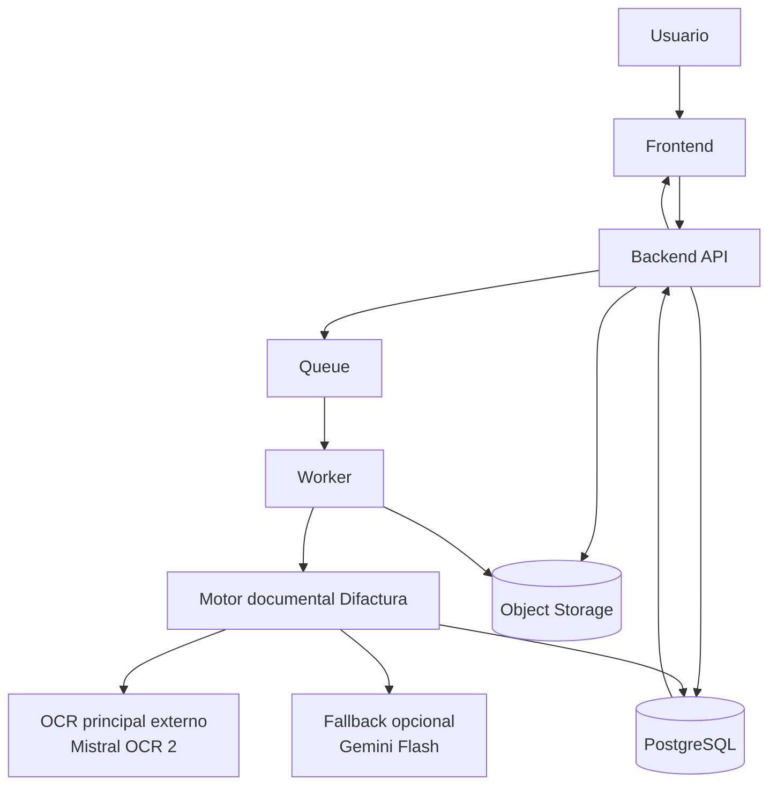
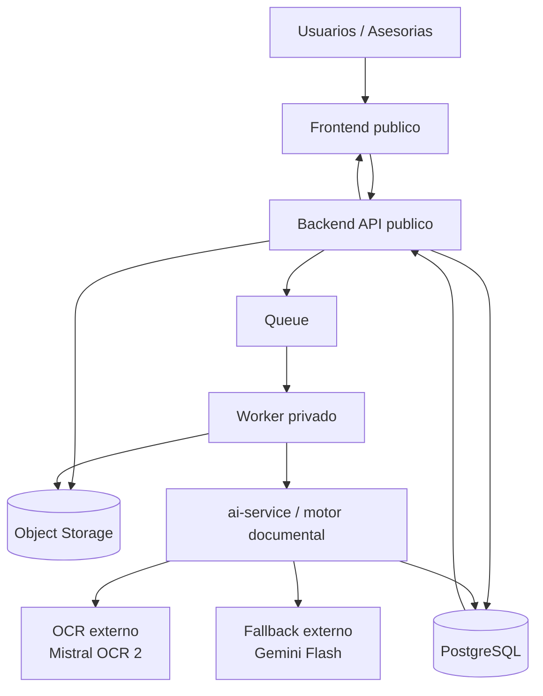

# Difactura - Documento maestro del motor documental

## 1. Proposito de este documento

Este archivo es la fuente de verdad para la siguiente etapa del proyecto.

Su funcion es que, aunque cambie el chat, el contexto o incluso parte del equipo, aqui quede explicado:

- que queremos construir
- por que lo queremos asi
- que se mantiene del MVP actual
- que se va a cambiar
- como debe quedar la arquitectura final del motor
- cual es el orden recomendado de implementacion
- que decisiones estan cerradas
- que cambios ya se han hecho
- que queda pendiente

Este documento debe poder pasarse a otro chat y servir para continuar el trabajo sin tener que reexplicar todo desde cero.

---

## 2. Regla de uso de este documento

Este archivo debe tratarse como un documento vivo.

Regla operativa:

- cada decision importante de arquitectura debe reflejarse aqui
- cada cambio importante del motor debe reflejarse aqui
- cada cambio de proveedor, contrato o flujo debe reflejarse aqui
- cada fase cerrada debe marcarse aqui
- cada cambio que altere el objetivo final debe corregirse aqui primero o a la vez

Cuando hagamos cambios reales en el repo, este documento debe actualizarse para dejar escrito:

- que se ha cambiado
- como queda el sistema despues del cambio
- si ese cambio altera el plan
- que siguiente paso desbloquea

Este archivo no sustituye a la documentacion tecnica detallada, pero si debe seguir siendo el resumen maestro de la vision y del estado del trabajo.

Documentacion que sigue vigente junto a este archivo:

- `docs/contrato-datos-documentales-y-contables.md`
- `docs/api-endpoints.md`
- `docs/deployment.md`

---

## 3. Contexto actual del proyecto

### 3.1 Repo canonico

- ruta canonica: `C:\Users\raule\Documents\DISOFT-NEW`
- no usar la copia vieja `C:\Users\raule\Documents\DISOFT`

### 3.2 Estado de producto

El proyecto actual es un MVP funcional orientado a:

- subir documentos
- procesarlos
- revisarlos
- validarlos

La UI esta bastante avanzada y es valida como base de producto.
El backend tambien es valido como base operativa.
La parte aun no resuelta del todo es la robustez documental.

### 3.3 Prioridad real en esta etapa

La prioridad ahora no es:

- cerrar la persistencia definitiva
- integrar la base de datos real de la empresa
- generar asientos contables finales

La prioridad ahora si es:

- construir un motor documental muy robusto
- desacoplarlo del MVP actual
- dejarlo preparado para conectarlo despues al sistema real

### 3.4 Restricciones funcionales ya conocidas

El producto debe soportar, como minimo:

- PDF digital
- PDF escaneado
- PDF con una foto dentro
- foto movil
- tickets y facturas simplificadas
- facturas multipagina
- IGIC
- IRPF o retencion
- rectificativas e importes negativos

---

## 4. Objetivo final de esta etapa

El objetivo de esta fase es construir un motor documental que:

- funcione para muchas empresas distintas
- no dependa de nombres concretos en runtime
- aguante layouts muy variados
- soporte volumen alto
- pueda operar para varias asesorias a la vez
- tenga una salida estandar reutilizable
- no dependa de la base de datos provisional del MVP

La idea es mantener el frontend y el backend actuales, pero hacer que el motor documental sea una pieza independiente y portable.

Cuando mas adelante llegue la integracion con la base de datos real de una empresa:

- no se rehace el motor
- no se rehace la UI de revision
- no se rehace la logica documental
- se adapta la capa que persiste o integra el resultado

---

## 5. Decision de producto cerrada

La app actual se va a usar como banco de pruebas y entorno de validacion del motor documental.

Esto implica:

- se conserva el front
- se conserva el backend
- se conserva el flujo de subida, revision y validacion
- se desacopla el motor documental del modelo provisional de persistencia

La decision estrategica es:

- no optimizar ahora la integracion final con la BD real
- optimizar ahora la calidad del motor documental

---

## 6. Principios de diseno del motor

El motor documental debe cumplir estos principios.

### 6.1 Agnostico de empresa

- no hardcodes en runtime
- no logica dependiente de Disoft
- el contexto de empresa se usa como pista, no como verdad absoluta

### 6.2 Agnostico de persistencia

- no depender de tablas concretas del MVP
- no mezclar OCR con guardado final
- exponer una salida estable y portable

### 6.3 Layout-aware

- no trabajar solo con `raw_text`
- trabajar con paginas, spans, bloques, regiones y geometria
- usar evidencia por campo

### 6.4 Determinista donde sea posible

- reglas matematicas y fiscales fuertes
- nada de inventar datos si hay conflicto
- preferir marcar revision a resolver mal

### 6.5 Escalable

- desacoplar subida de procesamiento
- soportar varios workers
- soportar miles de documentos al mes
- soportar varias asesorias trabajando a la vez

---

## 7. Lo que se mantiene del MVP actual

Se mantiene como base valida:

- frontend de subida, revision y validacion
- backend como API de negocio
- autenticacion y contexto de empresa
- estados de factura y jobs
- auditoria y trazabilidad
- concepto de empresa asociada y contraparte
- revision humana como paso fuerte del producto

Esto significa que no se pretende tirar la app actual.
Se pretende cambiar el nucleo de extraccion y su arquitectura para que el producto final no dependa del modelo provisional.

---

## 8. Lo que cambia

### 8.1 Cambia la pieza central

La extraccion deja de estar pensada como:

- OCR local + regex + heuristicas como camino principal

Y pasa a pensarse como:

- parser documental fuerte como lectura principal
- bundle interno comun
- resolvedor propio de Difactura
- fallback selectivo
- confianza y review

### 8.2 Cambia el papel del ai-service

El `ai-service` deja de ser solo un conjunto de utilidades OCR y pasa a ser:

- el motor documental desacoplado
- con contrato estable
- con proveedor OCR configurable
- con resolvedor propio

### 8.3 Cambia el papel del backend

El backend no debe ser el sitio donde viva la inteligencia documental principal.

El backend debe ser:

- cliente del motor
- orquestador de jobs
- adaptador temporal al modelo del MVP
- puerta de entrada al futuro sistema final

---

## 9. Arquitectura objetivo del motor

La arquitectura objetivo es esta:

```text
Documento
  -> clasificacion de entrada
  -> OCR/document parser principal
  -> bundle interno de Difactura
  -> generadores de candidatos
  -> resolvedor global
  -> confidence gate
  -> fallback selectivo
  -> normalized_document + evidence + flags
```

### 9.1 Clasificacion de entrada

El motor debe distinguir al menos:

- `pdf_digital`
- `pdf_scanned`
- `pdf_photo`
- `image_photo`
- `ticket`
- `simplified_invoice`
- `multipage`

### 9.2 OCR / parser principal

Debe devolver, como minimo:

- texto por pagina
- estructura o bloques
- bounding boxes
- tablas o lineas detectadas
- suficiente informacion para reconstruir evidencia

### 9.3 Bundle interno

Todo proveedor externo debe mapearse a un formato interno comun con:

- `pages`
- `spans`
- `regions`
- `raw_text`
- `input_profile`
- `candidates`

### 9.4 Resolucion global

Sobre el bundle interno, el motor debe resolver:

- numero de factura
- fecha
- emisor
- receptor
- contraparte
- compra o venta
- base imponible
- impuestos
- retenciones
- total
- tipo documental
- lineas
- rectificativa y signos

### 9.5 Confidence gate

La confianza debe construirse con:

- evidencia real
- acuerdo entre fuentes
- coherencia matematica
- company match
- conflictos o flags

### 9.6 Fallback

Solo se llama cuando:

- la confianza global es insuficiente
- faltan campos criticos
- hay conflicto fuerte entre campos
- el documento pertenece al long tail

### 9.7 Router tecnico de entrada

El sistema debe incorporar un router tecnico que decida la mejor ruta de procesamiento segun el tipo de entrada.

Este router no debe clasificar por empresa ni por plantilla concreta.

Debe clasificar por familias documentales genericas, por ejemplo:

- `pdf_digital`
- `pdf_scanned`
- `pdf_photo`
- `image_photo`
- `ticket`
- `simplified_invoice`
- `multipage`

Su funcion es elegir la ruta tecnica mas eficiente y robusta.

Ejemplos:

- si el documento es `pdf_digital` y trae texto nativo util, debe seguir la ruta mas barata posible
- si el documento es escaneado o foto, debe seguir la ruta visual principal
- si parece ticket o simplificada, debe usar la ruta mas adecuada para ese tipo
- si la confianza final es baja, debe activarse el fallback

Regla importante:

- el router no debe depender de nombres de empresa
- el router no debe depender de layouts concretos ya conocidos
- el router debe clasificar por comportamiento documental, no por proveedor o plantilla

Bien diseniado, este router debe mejorar coste y robustez a la vez.

### 9.8 Matriz de familias documentales

Para preparar el motor frente a documentos no vistos sin hardcodes, Difactura debe trabajar con una matriz explicita de familias documentales y variantes.

Regla:

- no pensar en empresas concretas
- no pensar en plantillas concretas
- pensar en familias canonicas y ejes de variacion

La referencia operativa de esa matriz vive en:

- `ai-service/benchmarks/unseen_companies/family_matrix.json`

Esa matriz debe usarse para:

- clasificar cada bug real dentro de una familia general
- decidir que caso sintetico o perturbado anadir
- detectar huecos de cobertura antes de que lleguen facturas reales nuevas
- mantener el crecimiento del motor de forma modular y sin excepciones por empresa

Familias canonicas minimas ya fijadas:

- `sale_visual_summary`
- `sale_header_two_columns_person`
- `sale_tabular_company_person`
- `shipping_billing_purchase`
- `label_value_purchase`
- `purchase_with_irpf`
- `purchase_codes_serials`
- `purchase_tabular_discount`
- `multipage_purchase`
- `ticket_simplified`
- `ticket_tax_breakdown`
- `rectificativa_negative`
- `visual_noise_variants`

Cada mejora nueva del motor deberia poder responder:

1. que familia cubre
2. que eje de variacion activa
3. que riesgo general corrige
4. como se valida sin romper `real_invoices` ni `unseen_companies`

---

## 10. Recomendacion tecnica actual

### 10.1 Opcion recomendada hoy

La recomendacion principal actual es:

- OCR/document parser primario: `Mistral OCR 2`
- resolvedor documental: logica propia de Difactura
- fallback: `Gemini Flash Lite` o `Gemini Flash`
- review: siempre disponible para casos dudosos

### 10.2 Motivo

Esta opcion ofrece un equilibrio especialmente bueno entre:

- coste
- robustez
- escalabilidad
- flexibilidad
- esfuerzo de mantenimiento

No se considera buena idea para el producto final depender solo de:

- regex
- OCR local gratuito
- LLM generico multimodal como unico extractor

### 10.3 Importante

Esto no significa que todo lo local se tire.
Significa que:

- el OCR local deja de ser el primario
- el bundle interno y el resolvedor siguen siendo muy valiosos
- la inteligencia propia de negocio sigue siendo de Difactura

---

## 11. Flujo objetivo de extremo a extremo

### 11.1 Flujo funcional

1. El usuario sube el documento desde la web.
2. El backend registra la subida y crea el job.
3. El worker recoge el job.
4. El motor clasifica el documento.
5. El motor llama al proveedor OCR principal.
6. La respuesta externa se convierte al bundle interno.
7. Difactura resuelve el documento completo.
8. Si hace falta, se llama al fallback.
9. Se genera la salida normalizada con evidencia y flags.
10. El backend persiste ese resultado en el MVP.
11. La UI lo muestra para revision y validacion.

### 11.2 Flujo futuro

Cuando exista conexion con la base de datos real:

1. El documento se procesa con el mismo motor.
2. Se obtiene el mismo contrato de salida.
3. Una capa adaptadora lo mapea al modelo real de la empresa.
4. Se persiste o sincroniza con el sistema real.

El motor debe ser la pieza estable entre el MVP actual y el producto final.

---

## 12. Contrato estable del motor

La salida del motor debe congelarse y tratarse como API interna estable.

Debe devolver, como minimo:

- `normalized_document`
- `field_confidence`
- `coverage`
- `evidence`
- `decision_flags`
- `company_match`
- `processing_trace`
- `raw_text`
- `warnings`

Dentro de `normalized_document` deben existir, como minimo:

- `document_meta`
- `classification`
- `identity`
- `issuer`
- `recipient`
- `totals`
- `tax_breakdown`
- `withholdings`
- `line_items`
- `payment_info`

Relacion directa con:

- `docs/contrato-datos-documentales-y-contables.md`

Este contrato debe vivir por encima del MVP.
El backend actual lo adaptara temporalmente.
El producto final lo adaptara despues a la BD real.

---

## 13. Arquitectura del sistema y ubicacion de piezas

Esta seccion describe como debe entenderse el sistema completo y donde vive cada pieza.

### 13.1 Arquitectura logica del sistema

La arquitectura logica objetivo es esta:

```text
Usuario
  -> Frontend web
  -> Backend API
  -> Queue
  -> Worker de extraccion
  -> Motor documental
  -> OCR/document parser externo
  -> Fallback LLM externo
  -> Resultado normalizado
  -> Revision humana
```

Traducido a responsabilidades:

- el frontend presenta la experiencia de usuario
- el backend gestiona negocio, auth, estados, empresas y jobs
- la cola desacopla la subida del procesamiento
- el worker ejecuta los jobs pesados
- el motor documental interpreta el documento
- los proveedores externos leen o ayudan a leer el documento
- la UI de revision muestra el resultado y permite validarlo

### 13.2 Flujo tecnico del sistema

```text
Frontend
  -> Backend API
  -> PostgreSQL + Object Storage + Queue
  -> Worker
  -> Motor documental
  -> Proveedor OCR principal
  -> Fallback opcional
  -> Backend
  -> Frontend
```

El flujo real debe ser:

1. el frontend sube el archivo
2. el backend registra documento, empresa y job
3. el original queda almacenado
4. la cola entrega el trabajo a un worker
5. el worker llama al motor documental
6. el motor llama al OCR principal
7. el motor construye el bundle interno
8. el resolvedor genera el `normalized_document`
9. si hay conflicto, entra el fallback
10. el backend persiste el resultado
11. el frontend lo presenta para revision

### 13.2.1 Diagrama visual del sistema

Diagrama en texto:

```text
                           +------------------+
                           |     Usuario      |
                           +---------+--------+
                                     |
                                     v
                           +------------------+
                           |     Frontend     |
                           | subida/revision  |
                           +---------+--------+
                                     |
                                     v
                           +------------------+
                           |   Backend API    |
                           | auth/jobs/audit  |
                           +---+----------+---+
                               |          |
                  metadata/jobs |          | consulta resultado
                               v          |
                    +------------------+  |
                    |    PostgreSQL    |<-+
                    | estados/auditoria|
                    +------------------+
                               ^
                               |
                               |
                     +---------+---------+
                     |       Queue       |
                     |  reparto jobs     |
                     +---------+---------+
                               |
                               v
                     +-------------------+
                     |      Worker       |
                     | ejecuta extraccion|
                     +---------+---------+
                               |
                               v
                     +-------------------+
                     |   Motor Difactura |
                     | bundle/resolver   |
                     +---+-----------+---+
                         |           |
             OCR primario|           |fallback opcional
                         v           v
            +-----------------+   +------------------+
            | OCR externo     |   | LLM fallback     |
            | Mistral OCR 2   |   | Gemini Flash     |
            +-----------------+   +------------------+
                         ^
                         |
                         |
                  +------+------+
                  | Object      |
                  | Storage     |
                  | originales  |
                  +-------------+
```

Diagrama mermaid:



### 13.3 Donde vive cada pieza en el repo actual

La distribucion actual del repo debe entenderse asi:

### Frontend

- vive en `frontend/`
- responsabilidad:
  - subida
  - bandeja
  - detalle
  - revision
  - validacion

### Backend API

- vive en `backend/`
- responsabilidad:
  - auth
  - empresas
  - endpoints
  - jobs
  - auditoria
  - adaptacion temporal al modelo del MVP

### Motor documental

- vive en `ai-service/`
- responsabilidad:
  - clasificacion de entrada
  - OCR client
  - construccion de bundle
  - generacion de candidatos
  - resolvedor global
  - confianza
  - fallback

### Persistencia provisional

- esquema y seeds: `database/`
- storage local de desarrollo: `storage/`

### Documentacion maestra

- vive en `docs/`
- este archivo es el documento rector de la nueva etapa

### 13.4 Donde debe vivir cada pieza a nivel de codigo

Aunque el repo actual ya existe, la direccion objetivo debe ser esta:

### `frontend/`

Debe seguir siendo el cliente de:

- subida
- revision
- validacion
- evidencia
- confianza

### `backend/`

Debe quedarse con:

- API de negocio
- auth
- empresas y asesoria
- jobs y estados
- auditoria
- capa adaptadora al contrato del motor

No debe crecer como lugar de inteligencia documental principal.

### `ai-service/`

Debe concentrar el motor documental.

Su estructura ideal acabara tendiendo a algo asi:

```text
ai-service/app/
  routes/
  models/
  services/
    provider_clients/
    bundle_builders/
    candidate_generators/
    resolvers/
    confidence/
    fallback/
```

No hace falta llegar de golpe a esta estructura, pero esa es la direccion objetivo.

### 13.5 Donde debe vivir cada pieza en despliegue

En produccion, la separacion recomendada es esta:

### Servicio frontend

- sirve la web
- no procesa OCR

### Servicio backend-api

- expone endpoints
- no ejecuta procesamiento pesado inline

### Servicio worker

- consume jobs
- ejecuta el motor documental
- escala horizontalmente

### Base de datos

- guarda metadata, jobs, auditoria y resultados

### Object storage

- guarda los archivos originales

### OCR/document parser externo

- proveedor principal de lectura documental

### Fallback externo

- ayuda solo en casos con baja confianza

### Queue

- desacopla entrada y procesamiento

### 13.6 Regla de separacion entre piezas

La separacion correcta debe ser esta:

- frontend no conoce detalles del OCR
- backend no conoce detalles internos del proveedor OCR
- backend conoce el contrato del motor, no la implementacion del motor
- el motor conoce el bundle interno y los proveedores
- los proveedores no conocen nada del modelo del MVP

Esta regla es clave para poder migrar luego al producto final sin rehacer todo.

---

## 14. Arquitectura de despliegue objetivo

La arquitectura objetivo para volumen real no debe ser un unico servidor con todo junto.

La topologia objetivo es:

```text
Frontend
Backend API
Queue
Worker de extraccion
PostgreSQL
Object Storage
OCR/document parser externo
Fallback LLM externo
```

### 14.0 Diagrama de alojamiento del sistema

Este diagrama responde a donde estaria alojado cada bloque del sistema.

Diagrama en texto:

```text
                 INTERNET / USUARIOS
                         |
                         v
              +-------------------------+
              |   Frontend desplegado   |
              |   web publica           |
              +-----------+-------------+
                          |
                          v
              +-------------------------+
              |    Backend API publico  |
              | auth, jobs, revision    |
              +-----+-------------+-----+
                    |             |
                    |             |
                    v             v
        +------------------+   +------------------+
        |   PostgreSQL     |   |  Object Storage  |
        | metadata/jobs    |   | originales PDF   |
        +------------------+   +------------------+
                    ^             ^
                    |             |
                    +------+------+ 
                           |
                           v
                 +----------------------+
                 |        Queue         |
                 | trabajos pendientes  |
                 +----------+-----------+
                            |
                            v
                 +----------------------+
                 | Worker de extraccion |
                 | servicio privado     |
                 +----------+-----------+
                            |
                            v
                 +----------------------+
                 |  ai-service / motor  |
                 | documental privado   |
                 +-----+-----------+----+
                       |           |
                       v           v
            +----------------+  +----------------+
            | OCR externo    |  | Fallback LLM   |
            | Mistral OCR 2  |  | Gemini Flash   |
            +----------------+  +----------------+
```

Diagrama mermaid:



Lectura recomendada del diagrama:

- `Frontend` y `Backend API` son las piezas publicas
- `Queue`, `Worker`, `ai-service`, `PostgreSQL` y `Object Storage` forman la parte interna del sistema
- el `ai-service` vive como servicio privado, no como API publica abierta
- el OCR principal y el fallback viven fuera de nuestra infraestructura y se consumen por API
- el usuario nunca habla directamente con el OCR ni con el fallback

Ubicacion recomendada por piezas:

- `Frontend`: servicio web publico
- `Backend API`: servicio publico protegido
- `PostgreSQL`: servicio privado interno
- `Object Storage`: almacenamiento gestionado
- `Queue`: servicio interno
- `Worker`: servicio privado y escalable
- `ai-service`: servicio privado de extraccion
- `Mistral OCR 2`: proveedor externo
- `Gemini Flash`: proveedor externo

Regla importante:

- el `ai-service` no deberia exponerse publicamente si no hace falta
- el `Worker` y el `ai-service` deben vivir en red privada o equivalente
- solo `Frontend` y `Backend API` deben ser piezas publicas

### 14.1 Responsabilidades

Frontend:

- subida
- bandeja
- revision
- validacion

Backend API:

- auth
- empresa activa
- auditoria
- jobs
- consulta de resultados
- adaptacion temporal al MVP

Queue:

- desacoplar subida de procesamiento
- soportar lotes grandes
- reintentos
- recuperacion de errores

Worker:

- descargar documento
- llamar al OCR principal
- construir bundle
- resolver campos
- llamar al fallback si toca
- devolver resultado estructurado

Object Storage:

- originales
- previsualizacion
- acceso de workers

### 14.2 Escalado

El escalado clave no es el del frontend.
Es el de los workers.

Debe ser posible:

- procesar varias asesorias a la vez
- tener miles de documentos en cola
- aumentar workers sin tocar frontend
- limitar la concurrencia por tenant si hace falta

---

## 15. Docker y entorno local

Docker sigue siendo la herramienta recomendada para desarrollo y pruebas locales.

En esta nueva fase:

- si, se sigue usando `docker compose`
- si, se sigue validando ahi el stack local
- si, se sigue usando para benchmark, reproceso y regresion

Pero hay que distinguir:

- Docker actual: entorno de desarrollo y pruebas
- arquitectura final: despliegue desacoplado y escalable

Comandos actuales de referencia:

- levantar: `docker compose --profile doc-ai-text up -d --build`
- apagar: `docker compose --profile doc-ai-text down`

Mas adelante, el compose puede evolucionar, pero debe seguir siendo util para trabajar localmente.

---

## 16. Que no se debe cerrar todavia

En esta fase no hace falta cerrar:

- esquema final de la base de datos real
- integracion ERP
- persistencia contable definitiva
- estrategia final de exportacion contable

Lo que si debe cerrarse ahora es:

- el contrato estable del motor
- la interfaz de proveedor OCR
- la arquitectura interna del ai-service
- la estrategia de confianza y review
- el roadmap de migracion

---

## 17. Roadmap maestro de implementacion

Este es el orden recomendado de trabajo.

Regla de ejecucion:

- no introducir varias piezas complejas nuevas a la vez
- no meter el fallback multimodal desde el primer sprint
- construir primero una ruta principal estable
- endurecer benchmark y regresion antes de abrir mas caminos

Orden deliberado de complejidad:

1. contrato estable
2. bundle interno estable
3. interfaz de proveedor
4. adaptar el motor al nuevo contrato
5. proveedor principal externo
6. benchmark fuerte
7. fallback selectivo
8. migracion
9. carga y concurrencia

### Fase 0 - Congelar el estado actual

Objetivo:

- guardar en Git el MVP actual como punto estable

Estado:

- pendiente de cierre manual por el usuario fuera de este documento

### Fase 1 - Congelar el contrato del motor

Objetivo:

- definir formalmente la entrada y salida estable del motor
- alinear `ai-service`, backend y documentacion con ese contrato
- dejar separadas la salida estable y la compatibilidad temporal del MVP
- fijar la semantica de valores observados, resueltos e inferidos

Resultado esperado:

- el motor ya tiene una interfaz que sobrevive aunque cambie la persistencia
- `normalized_document` queda fijado como payload principal
- `legacy_flattened_v1` queda explicitado como compatibilidad transitoria

Estado:

- cerrado en su primera version

### Fase 2 - Definir el bundle interno estable

Objetivo:

- fijar la representacion interna comun del documento
- desacoplar el resolvedor de cualquier respuesta cruda de proveedor

Resultado esperado:

- el sistema ya trabaja sobre:
  - `pages`
  - `spans`
  - `regions`
  - `input_profile`
  - `candidates`
- el bundle pasa a ser la base comun del motor

Estado:

- cerrado en su primera version

### Fase 3 - Introducir interfaz de proveedor OCR

Objetivo:

- separar el proveedor OCR del resto del motor
- permitir cambiar de OCR sin reescribir el resolvedor

Resultado esperado:

- existe un `provider client` o interfaz equivalente
- OCR local y OCR externo son implementaciones distintas

Estado:

- cerrado en su primera version

### Fase 4 - Adaptar el ai-service al nuevo contrato sin cambiar aun de proveedor

Objetivo:

- hacer que el `ai-service` actual ya se apoye en:
  - contrato estable
  - bundle interno
  - interfaz de proveedor
- mantener una ruta actual o local mientras cerramos estructura

Resultado esperado:

- frontend y backend siguen funcionando
- el motor ya tiene la forma correcta aunque aun no use el proveedor externo como principal

Estado:

- cerrado en su primera version

### Fase 5 - Hacer que proveedor externo sea el camino principal

Objetivo:

- conectar el proveedor externo recomendado
- convertir su salida al bundle interno

Resultado esperado:

- el OCR local deja de ser la ruta principal
- el bundle interno sigue siendo el centro del sistema

Estado:

- cerrado en su primera version

### Fase 6 - Mantener OCR local como fallback tecnico

Objetivo:

- conservar OCR local como respaldo o via de depuracion

Resultado esperado:

- el sistema no depende de una sola pieza externa para poder desarrollarse

Estado:

- cerrado en su primera version

### Fase 7 - Afinar resolvedor documental

Objetivo:

- reforzar:
  - contraparte
  - compra o venta
  - impuestos
  - rectificativas
  - tickets
  - multipagina

Resultado esperado:

- el motor generaliza mejor a familias documentales nuevas

Estado:

- cerrado en su primera version

Implementado en esta fase:

- existe un `document_semantic_resolver` central para:
  - `document_type`
  - `tax_regime`
  - `operation_kind`
  - `invoice_side`
  - `is_rectificative`
  - `is_simplified`
  - `company_match`
- `document_intelligence` ya usa ese resolvedor como fuente semantica comun
- `normalized_document` deja de decidir su clasificacion por caminos separados
- la semantica ya queda alineada entre:
  - `legacy_data.tipo_factura`
  - `company_match`
  - `classification`

### Fase 8 - Endurecer benchmark y regresion

Objetivo:

- ampliar benchmark real
- crear familias nuevas
- medir por campo
- comparar ruta principal frente a rutas de respaldo

Resultado esperado:

- no se rompe lo ya bueno
- se detecta mejor el progreso real
- existe una base objetiva antes de meter fallback multimodal

Estado:

- cerrado en su primera version

Implementado en esta fase:

- el benchmark real ya mide:
  - por caso
  - por familia
  - por campo
- cada caso real tiene `family` documental explicita
- el runner ya soporta rutas de comparacion:
  - `configured`
  - `local_only`
  - `mistral_primary`
  - `mistral_only`
- el runner ya puede exportar resumen JSON
- el runner ya tolera errores de entorno por caso sin abortar toda la bateria

### Fase 9 - Introducir fallback selectivo

Objetivo:

- llamar a un segundo modelo solo en casos dudosos

Resultado esperado:

- mas cobertura sin disparar costes

Estado:

- cerrado en su primera version

Implementado en esta fase:

- `doc_ai` ya no entra por defecto cuando esta activado
- el segundo motor solo se consulta si la salida primaria queda dudosa
- el gating actual tiene en cuenta:
  - confianza global
  - campos criticos con baja confianza
  - `missing_required_fields`
  - flags de revision
  - ambiguedad de `company_match` en entradas visuales
- si el fallback mejora el documento, la salida final queda marcada con:
  - `method=doc_bundle_doc_ai_fallback`
- si el fallback falla, se conserva la salida primaria y se registra el error tecnico

### Fase 10 - Preparar migracion a producto final

Objetivo:

- dejar una capa adaptadora entre el contrato del motor y la persistencia real

Resultado esperado:

- el motor ya es portable al sistema final

Estado:

- cerrado en su primera version

Implementado en esta fase:

- el backend ya tiene una capa adaptadora explicita entre:
  - contrato del motor
  - persistencia del MVP actual
- `documentProcessingService` deja de mezclar:
  - orquestacion del job
  - adaptacion del resultado
  - payload de persistencia
- la adaptacion temporal al MVP vive en un servicio propio y aislable
- esto deja preparado el cambio futuro a:
  - BD real de empresa
  - ERP real
  - otro repositorio de persistencia
  sin tener que reescribir el motor documental

### Fase 11 - Prueba formal de carga y concurrencia

Objetivo:

- demostrar que la arquitectura soporta concurrencia real de varias asesorias

Escenario minimo a validar:

- `3 asesorias`
- `50 archivos por asesoria`
- `150 documentos` entrando practicamente a la vez

La mezcla de documentos debe incluir, si es posible:

- PDF digital
- PDF escaneado
- PDF con foto
- foto movil
- ticket
- multipagina

Metricas a recoger:

- tiempo de respuesta de subida
- numero de jobs creados correctamente
- profundidad maxima de cola
- throughput de procesamiento
- errores y reintentos
- tiempo total hasta vaciar la cola
- uso de CPU y memoria en servicios internos
- si existe o no bloqueo entre asesorias

Criterios de aceptacion:

- la subida debe seguir respondiendo rapido
- no se deben perder documentos ni jobs
- la cola debe drenar de forma estable
- no debe haber bloqueo total de una asesoria sobre otra
- el sistema debe mantenerse operativo sin reinicios inesperados

Estado:

- pendiente y obligatorio antes de considerar la arquitectura lista para volumen real

---

## 18. Impacto esperado en el repo actual

### 18.1 Frontend

Debe mantenerse con cambios minimos.

Debe seguir consumiendo:

- datos extraidos
- confianza
- evidence
- flags
- company_match

### 18.2 Backend

Debe mantenerse como:

- API de negocio
- gestor de jobs
- capa adaptadora al MVP actual

Debe ir sacando de su interior cualquier logica documental que no le pertenezca.

### 18.3 AI service

Debe evolucionar a una arquitectura por capas:

- `provider_client`
- `bundle_builder`
- `candidate_generators`
- `global_resolver`
- `confidence_scorer`
- `fallback_resolver`

### 18.4 Persistencia

La persistencia actual puede seguir existiendo mientras se construye el motor.

Pero no debe condicionar:

- el contrato del motor
- el modelo documental
- la forma final de integrarse con la empresa real

---

## 19. Criterios de exito de esta estrategia

La estrategia se considerara correcta si:

- el motor procesa mejor documentos nuevos sin hardcodes por empresa
- la contraparte mejora y se mantiene estable
- compra y venta se detectan con alta fiabilidad
- los casos dudosos se marcan en vez de inventarse
- varias asesorias pueden usar el sistema sin bloquearse entre si
- el motor puede trasladarse al producto final sin rehacerse
- la arquitectura supera una prueba formal de carga concurrente con varias asesorias

---

## 20. Regla de actualizacion futura

Cada vez que hagamos un cambio importante en esta linea de trabajo, este documento debe actualizarse en al menos una de estas partes:

- `Decision de producto cerrada`
- `Recomendacion tecnica actual`
- `Roadmap maestro de implementacion`
- `Impacto esperado en el repo actual`
- `Historial de cambios`

Si una decision nueva contradice lo que pone aqui, no debe dejarse el documento desactualizado.

---

## 20.1 Matriz de cobertura del motor

La generalizacion del motor no debe medirse por "cuantas empresas distintas" hemos visto,
sino por "cuantas variaciones documentales importantes" cubrimos.

Las dimensiones que hay que cubrir de forma explicita son estas:

- modalidad:
  - PDF digital
  - PDF escaneado
  - foto movil
  - ticket
  - multipagina
- layout:
  - dos columnas en cabecera
  - `shipping/billing`
  - proveedor solo en pie legal
  - `label-value`
  - tabla clasica
  - resumen visual disperso
- partes:
  - empresa contra empresa
  - empresa contra persona fisica
  - un solo tax id visible
  - varios tax ids visibles
  - tax id parecido a numero de factura
- fiscalidad:
  - IGIC
  - IVA
  - IRPF
  - varios tipos impositivos
  - impuesto incluido
  - rectificativa
- lineas:
  - una sola linea
  - descripcion multilinea
  - codigos y seriales
  - descuento
  - salto de pagina
- ruido:
  - blur
  - rotacion
  - bajo contraste
  - crop
  - compresion JPEG
  - mojibake
  - sombra

La consecuencia practica es esta:

- no basta con esperar a que lleguen empresas nuevas
- mientras no haya suficientes casos reales, hay que construir un corpus sintetico y perturbado que cubra estas dimensiones
- cada bug real nuevo debe convertirse en un caso de regresion y, si representa una variacion nueva, en una nueva etiqueta de esta matriz

### Corpus minimo recomendado

Para no depender solo del azar del mundo real, el plan minimo recomendado queda asi:

1. `18` casos sinteticos textuales
2. `24` casos perturbados visuales partiendo de facturas ya estables
3. `12` documentos reales de empresas no vistas cuando esten disponibles

### Tests metamorfos obligatorios

Hay invariantes que el motor deberia respetar aunque cambie un poco la forma del documento:

- cambiar `S.L.` por `SL` no debe invertir emisor y receptor
- mover el proveedor de cabecera al pie legal no debe hacer que desaparezca
- degradar acentos o introducir mojibake no debe cambiar la familia documental a una incoherente
- un numero de factura parecido a un `CIF/NIF` no debe promocionarse como tax id de partes
- si `shipping` y `billing` coinciden con la empresa asociada, deben seguir interpretandose como cliente y no como proveedor

### Benchmark de empresas no vistas

El benchmark de `ai-service/benchmarks/unseen_companies/` se convierte en el sitio oficial para:

- documentos reales no vistos
- casos sinteticos de generalizacion
- perturbaciones visuales

Y debe etiquetar cada caso por:

- modalidad
- layout
- fiscalidad
- ruido
- edge case semantico

Asi la pregunta deja de ser "cuantas facturas tenemos" y pasa a ser:

"que partes del espacio documental siguen sin cobertura".

## 21. Historial de cambios de este documento

### 2026-04-01

- se hace una auditoria estructural completa del `ai-service` con criterio de responsabilidad unica por archivo
- se parte `document_loader.py` en modulos dedicados dentro de `app/services/document_loading/`:
  - `pdf_loader.py`
  - `image_loader.py`
  - `page_images.py`
- `document_loader.py` queda como dispatcher fino de entrada
- se parte `ocr_service.py` en modulos dedicados dentro de `app/services/ocr_processing/`:
  - `image_flow.py`
  - `pdf_flow.py`
  - `region_hint_flow.py`
  - `availability.py`
- `ocr_service.py` queda como fachada publica de OCR y rescate por regiones
- se parte `document_intelligence.py` en modulos dedicados dentro de `app/services/document_intelligence_flow/`:
  - `prompt.py`
  - `primary_stage.py`
  - `fallback_stage.py`
  - `result_output.py`
- `document_intelligence.py` queda como coordinador puro del flujo del motor
- se parte `text_resolution/amounts.py` en `app/services/text_resolution/amount_resolution_parts/`
- se parte `text_resolution/family_corrections.py` en `app/services/text_resolution/family_corrections_parts/`
- tamanos de los coordinadores principales despues de esta iteracion:
  - `document_intelligence.py`: `183` lineas
  - `document_loader.py`: `59` lineas
  - `ocr_service.py`: `75` lineas
  - `text_resolution/amounts.py`: `26` lineas
  - `text_resolution/family_corrections.py`: `77` lineas
- conclusion estructural actual:
  - los archivos centrales del motor ya no mezclan carga, OCR, fallback, normalizacion y salida final en un mismo sitio
  - los archivos largos que quedan son de dominio especifico o de integracion de proveedor, no coordinadores mezclados
  - la suite completa del `ai-service` queda en `121 passed`
- se completa una segunda ola de modularizacion fina sobre modulos de dominio que aun concentraban varias subetapas internas
- `confidence_scorer.py` se parte en `app/services/confidence_scoring_parts/`:
  - `validators.py`
  - `penalties.py`
  - `contextual.py`
- `field_extraction/bundle.py` se parte en `app/services/field_extraction/bundle_parts/`:
  - `regions.py`
  - `scoring.py`
  - `selection.py`
- `field_extraction/party_parts/postprocessing.py` se parte en `postprocessing_parts/`:
  - `registry.py`
  - `cifs.py`
  - `header.py`
  - `ticket.py`
- `text_resolution/region_hint_rescue.py` se parte en `app/services/text_resolution/region_hint_rescue_parts/`:
  - `shared.py`
  - `candidates.py`
  - `apply.py`
- `text_resolution/normalization.py` se parte en `app/services/text_resolution/normalization_parts/`:
  - `identity.py`
  - `line_items.py`
  - `amounts.py`
- tras esta iteracion:
  - `document_intelligence.py` sigue en `183` lineas como orquestador principal
  - `document_loader.py` queda en `59` lineas
  - `ocr_service.py` queda en `75` lineas
  - `confidence_scorer.py`, `field_extraction/bundle.py`, `party postprocessing`, `region_hint_rescue.py` y `normalization.py` quedan convertidos en fachadas o servicios de fase, apoyados por submodulos internos
- conclusion estructural tras el refinado final:
  - los coordinadores principales ya no esconden bloques de logica heterogenea
  - los archivos que siguen relativamente largos son ya modulos de dominio o de integracion con proveedor, no mezclas de capas del motor
  - la suite completa del `ai-service` sigue en `121 passed`

### 2026-03-31

- el `company_context` ya baja hasta `bundle_factory` y `layout_analyzer`, de modo que la deteccion de `company_anchor` deja de depender de un contexto perdido en capas intermedias
- `layout_analysis/parties.py` deja atras el corte fijo por `left/right` y pasa a separar cabecera por clustering simple de columnas a partir de la geometria disponible
- `field_extraction/bundle.py` deja de resolver por "primer valor no vacio" y pasa a fusionar candidatos por score y prioridad de region (`header`, `parties`, `totals`, `line_items`, `full`)
- `operation_kind.py` reduce el peso de `invoice.tipo_factura` a una pista debil y deja de tratarlo como una verdad semantica fuerte
- `field_extraction/amounts.py` conserva el signo en base, impuesto y total para rectificativas negativas, manteniendo la retencion normalizada como importe positivo de dominio
- se anade cobertura de tests para:
  - paso de `company_context` hacia bundle/layout
  - rectificativas negativas sin perdida de signo
  - retencion con signo negativo en origen y valor positivo normalizado en salida
- se prepara un benchmark especifico para empresas no vistas con soporte de `--cases-path` y `--tag`; el arnes ya existe aunque todavia faltan documentos reales no vistos para poblarlo
- tras estos cambios, la suite de `ai-service` queda en `111 passed`
- se refuerza la resolucion general de partes para documentos visuales sin labels explicitos:
  - `party_resolution_parts/shared.py` deja de confundir `S.C.` con abreviaturas de direccion
  - `party_resolution_parts/raw_text.py` pasa a resolver bloques de cabecera por score, tax id y contexto en vez de elegir la primera linea parecida a empresa
  - `family_corrections.py` corrige el caso generico `company_sale` cuando la empresa asociada habia quedado como cliente en vez de emisor
- se anaden tests especificos de generalizacion para garantizar que:
  - un slogan corto no sustituye a un bloque con razon social + NIF
  - una venta visual con empresa asociada se resuelve como `venta` sin hardcodes por nombre
- tras esta correccion, la suite de `ai-service` queda en `118 passed`
- se hace una pasada especifica anti-hardcode sobre `ai-service/app`:
  - se verifica que en runtime ya no quedan nombres de empresas del benchmark dentro de la logica documental
  - se elimina el ultimo ejemplo de numero de factura concreto que quedaba en el prompt de `document_intelligence.py`
  - se deja claro como criterio de proyecto que si aparece un nombre de empresa o un numero real de benchmark dentro del runtime, debe tratarse como deuda tecnica y eliminarse
- siguen siendo validas y deliberadas las constantes generales del dominio:
  - keywords documentales (`FACTURA`, `NIF`, `CIF`, `BASE`, `TOTAL`, `IGIC`, `IVA`)
  - familias documentales (`ticket`, `factura_simplificada`, `shipping_billing_purchase`, `company_sale`, `rectificativa`)
  - nombres de contrato del motor y de bundles
- tras esta pasada anti-hardcode, la suite de `ai-service` queda en `121 passed`
- `evidence_builder.py` se parte en modulos especificos:
  - `evidence_building/field_evidence.py`
  - `evidence_building/decision_flags.py`
  - `evidence_building/processing_trace.py`
- `text_resolution/result_building.py` se parte en modulos especificos:
  - `result_building_parts/document_metadata.py`
  - `result_building_parts/confidence.py`
  - `result_building_parts/resolution.py`
  - `result_building_parts/shared.py`
- `document_intelligence.py` saca sus utilidades privadas y clientes Doc AI a:
  - `document_intelligence_flow/helpers.py`
  - `document_intelligence_flow/fallback_policy.py`
  - `document_intelligence_flow/provider_clients.py`
- tras esta poda adicional:
  - `document_intelligence.py` queda en `363` lineas
  - `text_resolution/result_building.py` queda en `113` lineas
  - `evidence_builder.py` queda en `61` lineas
- los archivos que siguen grandes pasan a ser candidatos de modularizacion de segundo nivel, no coordinadores mezclados:
  - `ocr_service.py`
  - `text_resolution/party_resolution.py`
  - `field_extraction/amounts.py`
  - `field_extraction/parties.py`
- se completa esa segunda oleada de modularizacion:
  - `ocr_service.py` se parte en `ocr_processing/shared.py`, `ocr_processing/tesseract.py`, `ocr_processing/paddle.py` y `ocr_processing/region_hints.py`
  - `text_resolution/party_resolution.py` pasa a ser una fachada sobre `party_resolution_parts/`
  - `field_extraction/amounts.py` queda respaldado por `field_extraction/amount_parts/`
- tras cerrar esa poda:
  - `ocr_service.py` queda en `170` lineas
  - `text_resolution/party_resolution.py` queda en `80` lineas
  - `document_intelligence.py` se mantiene en `363` lineas como orquestador de extremo a extremo
  - `document_loader.py` se mantiene en `192` lineas como coordinador de entrada, `input_profile` y bundle
- conclusion de esta fase de reestructuracion:
  - los coordinadores siguen existiendo
  - la logica pesada ya no vive mezclada dentro de ellos
  - cada paquete auxiliar se encarga ya de una responsabilidad concreta
- se limpia la primera tanda fuerte de sesgos de generalizacion:
  - `ocr_processing/region_hints.py` deja de usar keywords ligadas a ejemplos concretos como `DISOFT`, `SERVICIOS` o `PALMAS`
  - `party_resolution_parts/header.py` deja de vetar nombres por patrones especificos tipo `SERVI + INFORM`
  - `party_resolution_parts/shared.py` y `party_resolution_parts/raw_text.py` eliminan comparaciones rotas por mojibake y pasan a usar patrones mas tolerantes
- `field_extraction/bundle.py` deja de decidir solo por pesos fijos y pasa a combinar:
  - peso base por region
  - confianza media de la region
  - calidad del valor candidato
  - consenso entre regiones
- `layout_analysis/parties.py` deja de depender solo del 45% superior y ahora puede bajar hasta una ventana extendida cuando detecta senales de partes o tax ids
- se anade test especifico para asegurar que `build_party_regions()` no recorta parties validas situadas por debajo del corte base de cabecera
- tras esta tanda de limpieza y endurecimiento, la suite completa queda en `115 passed`
- conclusion funcional despues de esta iteracion:
  - el codigo esta bastante mas preparado para generalizar que antes
  - siguen faltando documentos reales de empresas no vistas para validar que esta mejora se traduce en generalizacion real

### 2026-04-01

- se cierra una ronda de endurecimiento del motor ya sobre la arquitectura modular:
  - resolucion de partes por bloques cohesivos
  - merge de bundle por entidad `nombre + tax_id` y no por campo suelto
  - penalizaciones semanticas reales en confianza
  - flags explicitos para roles imposibles o ambiguos
  - reduccion de dependencia de keywords en `compra/venta`
  - matching de empresa mas tolerante para pymes y nombres cortos
  - mejor seleccion de `%IVA/%IGIC` frente a porcentajes de retencion
- `field_extraction/bundle.py` deja de poder mezclar nombre de un bloque con NIF de otro al resolver proveedor y cliente
- `confidence_scorer` y `result_building` castigan ahora:
  - mismo NIF/CIF en emisor y receptor
  - misma entidad en ambos roles
  - ambiguedad de `company_match`
- `decision_flags` anade revisiones explicitas para:
  - `same_party_both_roles`
  - `same_tax_id_both_roles`
- `normalization_parts/amounts.py` deja de limpiar retencion dos veces en el flujo normal
- se endurece el tratamiento general de compras con layout `shipping/billing` sin hardcodes por empresa:
  - los posibles `CIF/NIF` leidos en lineas de metadatos como `factura num`, `documento`, `pedido` o `albaran` dejan de promocionarse como tax ids de partes
  - el proveedor del pie legal solo se promociona cuando de verdad hay contexto mercantil/legal (`registro`, `mercantil`, `inscripcion`) y no por cualquier linea final con `CIF`
  - los bloques `shipping/billing` se interpretan como cliente cuando coinciden con la empresa asociada
  - el proveedor externo del pie legal pasa a corregir la compra en esa familia documental cuando el bloque de facturacion pertenece a la empresa asociada
- `document_family.py` detecta mejor `shipping_billing_purchase` incluso con OCR degradado o texto con mojibake en `facturacion`
- despues de esta ronda, la suite completa del `ai-service` queda en `131 passed`
- se fija una matriz explicita de cobertura del motor para no depender solo de facturas reales no vistas:
  - ejes de modalidad, layout, partes, fiscalidad, lineas y ruido
  - corpus minimo recomendado de sinteticos, perturbaciones visuales y casos reales no vistos
  - uso oficial de `benchmarks/unseen_companies/` como benchmark de generalizacion
- se anade soporte en el runner de benchmark para casos sinteticos `raw_text` sin tocar la ruta normal de ficheros reales
- se amplia el corpus sintetico de `benchmarks/unseen_companies/` hasta `22` casos sinteticos y queda validado en `22/22`
- la ampliacion nueva cubre ademas:
  - compra `label-value` con varios tramos fiscales sin hardcodes de proveedor
  - ticket vertical con pago y cambio
  - compra `shipping/billing` en `pdf_photo` con proveedor solo en pie legal y sombra
  - venta foto con blur y sombra
- se corrige un fallo general de familia documental:
  - las facturas `label-value` con `Proveedor` y `Cliente` explicitos dejan de clasificarse erroneamente como `company_sale`
  - esto evita invertir emisor y receptor por culpa del `company_context` en compras y multipagina genericas
- se endurece la seleccion de lineas cuando hay varias fuentes equivalentes:
  - si dos juegos de lineas cuadran igual en importes, el motor pasa a preferir el que trae descripciones mas ricas y menos cortadas
  - esto recupera casos donde una descripcion quedaba truncada aunque el importe fuese correcto
- el benchmark real pasa a tolerar pequenas derivas OCR de una sola letra en `lineas.descripcion`
  - no relaja truncados reales
  - solo evita contar como regresion errores menores tipo `ANTIVIRUS/ANTIVIRUE` o `Facdis/Faodis`
- se corrigen dos sesgos generales destapados por el corpus sintetico ampliado:
  - los tax ids de `contacto` o `representante` dejan de competir con los de proveedor o cliente cuando estos vienen etiquetados
  - la deteccion de cabecera de tabla deja de arrancar sobre nombres normales que solo contienen la subcadena `art`
- se endurece la lectura numerica para que lineas de metadatos como `CIF`, `NIF`, `DNI`, `documento` o `pedido` no contaminen la inferencia de importes
- se ajusta la lectura de cuotas `IVA/IGIC` en lineas explicitas para no coger el `total` del lookahead cuando la cuota ya viene en la propia linea
- se anade una capa especifica para tickets y simplificadas sin hardcodes por empresa:
  - resolucion de proveedor en tickets desde cabecera legal y no desde lineas de telefono, mesa o ubicacion
  - exclusion de lineas de pago (`entregado`, `cambio`, `a devolver`) del total fiscal del ticket
  - reconstruccion de lineas horizontales y verticales de ticket sin inventar cliente
  - soporte de resumenes `BASE ... CUOTA ...` e inferencia del porcentaje `IVA/IGIC` cuando el ticket trae base y cuota pero no la tasa explicita
- se endurece la deteccion general de lineas con codigos y seriales:
  - los codigos cortos de articulo tipo `ESDPBUTF-1A4` dejan de romper la lectura de `cantidad + precio + importe`
  - los seriales/licencias dejan de colarse como descripciones o lineas adicionales
- se recalibra la confianza para tickets y facturas simplificadas:
  - los campos vacios esperables (`cliente`, `cif_cliente` y, si no existen, ciertos campos fiscales) dejan de hundir la confianza
  - la coherencia de lineas puede validarse contra `base` o contra `total` segun la familia documental
  - las correcciones esperables de ticket penalizan menos que en una factura completa
- el backend deja el reproceso desacoplado del pasado en la parte de confianza:
  - al solicitar reproceso, `confianza_ia` se limpia y deja de arrastrar el valor anterior
  - si existe un job mas nuevo que la ultima `PROCESADA_IA`, el detalle de extraccion ya no se expone como si fuese el actual
- estado verificado tras esta iteracion:
  - `python -m pytest ai-service/tests -q` -> `149 passed`
  - benchmark sintetico `unseen_companies` -> `22/22` y `241/241 checks`
  - benchmark real `real_invoices` en Docker -> `6/6` y `138/138 checks`
- `company_matching.py` se vuelve menos fragil con nombres donde antes se descartaban tokens de negocio demasiado pronto
- `operation_kind.py` pasa a normalizar texto sin acentos y a depender menos de palabras clave aisladas
- se anaden tests nuevos de:
  - cohesion de entidades en bundle
  - conflictos semanticos en confianza
  - matching de empresa con nombres cortos
  - preferencia de contexto de empresa frente a keywords de compra
  - seleccion correcta del tipo impositivo cuando tambien aparece retencion
- estado verificado tras esta tanda:
  - `python -m pytest ai-service/tests -q` -> `129 passed`
- conclusion de esta iteracion:
  - la estructura del `ai-service` ya no es el cuello principal
  - el motor decide mejor emisor/receptor, compania asociada y tipo de operacion que antes
  - sigue pendiente poblar `benchmarks/unseen_companies/cases.json` con documentos reales etiquetados para demostrar generalizacion fuera del dataset actual

### 2026-03-30

- se cierra la Fase 1 en su primera version
- se fija `normalized_document` como payload estable principal del motor
- se fija `legacy_flattened_v1` como compatibilidad temporal con el MVP actual
- se deja definida la semantica de valores `observed`, `resolved` e `inferred`
- se alinea el documento maestro con el contrato estable del motor y su version explicita
- se cierra la Fase 2 en su primera version
- se fija el bundle interno estable con contrato, input profile, source stats y candidate groups
- el loader pasa a construir ese bundle como representacion comun antes del resolvedor
- se cierra la Fase 3 en su primera version
- se introduce una interfaz de proveedor documental con implementacion local por defecto
- el loader y el rescate OCR dejan de depender directamente de `pdf_extractor` y `ocr_service`
- se cierra la Fase 4 en su primera version
- el `ai-service` pasa a devolver `ExtractionResult` como contrato interno real
- la ruta HTTP `/ai/process` queda como adaptador de serializacion y compatibilidad
- se cierra la Fase 5 en su primera version
- se integra Mistral como proveedor documental externo configurable
- el loader puede usar Mistral como ruta principal y caer al proveedor local si falla
- se cierra la Fase 6 en su primera version
- el fallback local deja de ser implicito y pasa a quedar trazado en `document_input`
- se anaden opciones para forzar proveedor y para configurar fallback tecnico en runtime
- se corrige la compatibilidad del proveedor Mistral con la libreria `mistralai` instalada
- `docker-compose` y `.env` quedan preparados para activar Mistral como parser principal con fallback local
- se cierra la Fase 7 en su primera version
- la semantica documental queda centralizada en un resolvedor comun para `document_type`, `invoice_side`, `operation_kind`, `company_match` y variantes simplificadas o rectificativas
- se cierra la Fase 8 en su primera version
- el benchmark real pasa a medir por campo, por familia y por ruta del motor
- se cierra la Fase 9 en su primera version
- el fallback selectivo solo llama a `doc_ai` cuando hay baja confianza, conflicto o campos criticos incompletos
- se cierra la Fase 10 en su primera version
- el backend incorpora una capa adaptadora explicita entre el contrato del motor y la persistencia temporal del MVP
- se valida la integracion real de Mistral en Docker con API key funcional y `ai-service` healthy
- la suite de `ai-service` queda en `112 passed`
- el benchmark real `local_only` queda en `6/6 OK`
- el benchmark real `mistral_only` queda en `2/6 OK`
- conclusion operativa actual:
  - Mistral ya esta integrado y usable para pruebas controladas
  - Mistral todavia no esta listo para sustituir a la ruta local como parser principal
  - la ruta local sigue siendo la referencia estable mientras se corrigen los casos de ventas foto y compras AV bajo Mistral
- se reescribe desde cero el resolvedor semantico para basarlo en:
  - matching de empresa por tax id y nombre
  - deteccion de familia documental por señales genericas
  - clasificacion `compra` o `venta` por puntuacion y no por default fijo
  - inferencia de `invoice_side` y `tax_regime` a partir de evidencia explicita
- el clasificador auxiliar deja de devolver `compra` por defecto cuando no hay senales claras
- tras el cambio, la ruta `local_only` se mantiene en `6/6 OK`
- el principal cuello pendiente ya no esta en el resolvedor local, sino en la calidad de interpretacion que llega por la ruta `configured` con Mistral en varios casos visuales
- se completa una reestructuracion interna del interpretador textual en servicios separados:
  - `text_resolution/party_resolution.py`
  - `text_resolution/line_items.py`
  - `text_resolution/amounts.py`
- `document_intelligence.py` deja de contener la logica principal de partes, lineas e importes y pasa a actuar mucho mas como orquestador
- se eliminan wrappers y bloques muertos del monolito que ya no participaban en el flujo real
- se completa una segunda poda grande del monolito con nuevos modulos dedicados a:
  - `text_resolution/normalization.py`
  - `text_resolution/family_corrections.py`
  - `text_resolution/region_hint_rescue.py`
  - `text_resolution/result_building.py`
- `document_intelligence.py` pasa de unas `1796` lineas a unas `505` lineas y queda centrado en:
  - orquestacion del flujo `extract`
  - decision de fallback Doc AI
  - clientes HTTP de proveedores externos
  - serializacion final del resultado
- la logica de normalizacion, correccion por familias, rescate OCR por regiones, construccion del resultado y scoring de campos deja de vivir en el monolito
- los tests se alinean con los servicios nuevos en vez de depender de metodos privados del coordinador
- la suite del `ai-service` se mantiene en `112 passed` despues de la poda
- se parte `field_extractor.py` en modulos dedicados dentro de `app/services/field_extraction/`:
  - `identity.py`
  - `parties.py`
  - `amounts.py`
  - `line_items.py`
  - `bundle.py`
  - `shared.py`
- `field_extractor.py` pasa a ser una fachada publica de unas `55` lineas
- desaparece del extractor el segundo monolito grande de parsing textual y la logica queda separada por responsabilidad
- los tests especificos del extractor quedan en `23 passed`
- se parte `layout_analyzer.py` en helpers dedicados dentro de `app/services/layout_analysis/`:
  - `shared.py`
  - `slices.py`
  - `keywords.py`
  - `parties.py`
- `layout_analyzer.py` queda como fachada fina de unas `20` lineas
- se parte `document_loader.py` en helpers dedicados dentro de `app/services/document_loading/`:
  - `provider_flow.py`
  - `bundle_factory.py`
  - `input_profile.py`
- `document_loader.py` deja de mezclar resolucion de proveedor, construccion de bundle y enriquecimiento de `input_profile`
- se elimina `invoice_classifier.py` del runtime para dejar una unica fuente semantica de clasificacion en `document_semantic_resolver`
- `document_intelligence.py` deja de duplicar la clasificacion `compra` o `venta` antes del pipeline semantico
- la suite completa del `ai-service` queda en `108 passed` tras eliminar ese bloque duplicado y cerrar la reestructuracion

### 2026-03-26

- se crea este documento como documento maestro de la nueva etapa
- se fija la estrategia de mantener frontend y backend y desacoplar el motor documental
- se fija como objetivo construir un motor portable al producto final
- se fija la recomendacion tecnica actual:
  - OCR/document parser primario externo
  - bundle interno propio
  - resolvedor de negocio propio
  - fallback selectivo
  - review humana
- se fija Docker como entorno local de pruebas
- se anade la arquitectura logica del sistema y la ubicacion de cada pieza en repo y despliegue
- se anade un diagrama textual y un diagrama mermaid del sistema objetivo
- se anade un diagrama especifico de despliegue y alojamiento de servicios
- se limpia `docs/` eliminando documentos desalineados con la nueva estrategia del motor
- se eliminan tambien `architecture.md`, `hito-1-contexto-asesoria.md` y `python-env.md` por no alinearse ya con el plan vigente
- se anade la idea del router tecnico por familias documentales genericas
- se anade una fase formal de prueba de carga y concurrencia para validar varias asesorias a la vez
- se refactoriza el roadmap en mas fases para introducir la complejidad de forma progresiva
