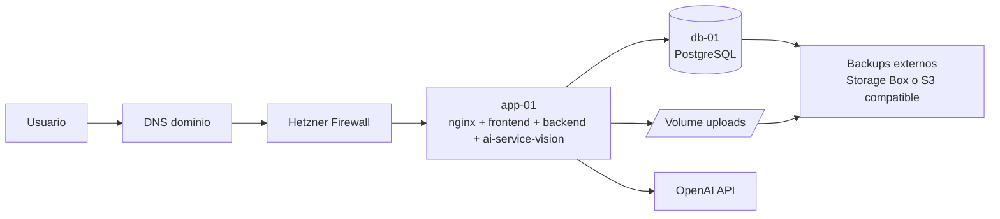

# Difactura: auditoria tecnica y plan de produccion en Hetzner

## 1. Resumen ejecutivo

Este documento resume la auditoria del sistema que hoy esta activo en el repositorio y propone una forma realista de ponerlo en produccion sobre Hetzner.

Conclusion corta:

- Si, Hetzner es una buena opcion para la primera produccion de Difactura.
- No recomiendo desplegar el estado actual del repo "tal cual".
- La arquitectura minima seria de 2 servidores: uno de aplicacion y otro de base de datos.
- `FAKEai-service-v2` queda fuera de alcance y no debe desplegarse.

El motivo por el que Hetzner encaja aqui es simple: el trabajo pesado de IA no lo hace la infraestructura propia, sino OpenAI. Eso baja mucho la necesidad de GPU y hace viable una arquitectura de Docker Compose bien cerrada, con buen coste y una operacion razonable.

---

## 2. Alcance de la auditoria

Servicios realmente activos revisados:

- `frontend/`: React 18 + Vite
- `backend/`: Node.js 20 + Express
- `ai-service-vision/`: FastAPI + OpenAI Vision
- `database/`: PostgreSQL 15
- `nginx/`: previsto para produccion, pero hoy incompleto
- `docker-compose.yml`: orquestacion actual

Servicio explicitamente descartado para produccion:

- `FAKEai-service-v2/`

---

## 3. Arquitectura real actual

### 3.1 Componentes

| Componente | Estado actual | Funcion |
|---|---|---|
| Frontend | Activo | SPA para login, subida, revision y listado |
| Backend | Activo | API REST, autenticacion, persistencia, cola y worker |
| AI Vision | Activo | Convierte PDF a imagenes y llama a OpenAI Vision |
| PostgreSQL | Activo | Persistencia de facturas, documentos, usuarios, auditoria y jobs |
| Nginx | Incompleto | Perfil de produccion declarado pero no operativo |

### 3.2 Flujo funcional real

1. El usuario entra al frontend y se autentica contra `POST /api/auth/login`.
2. El frontend guarda el JWT en `localStorage` y usa `/api` como base URL.
3. La subida de archivos entra por `POST /api/invoices/upload`.
4. El backend guarda el fichero en `storage/uploads`.
5. El backend crea una factura, un documento y un job en `processing_jobs`.
6. El worker interno del backend reclama jobs pendientes desde PostgreSQL.
7. El backend llama a `ai-service-vision` por HTTP interno.
8. `ai-service-vision` transforma el PDF en imagenes y llama a OpenAI.
9. El resultado vuelve al backend, que lo guarda en `facturas.documento_json`.
10. El usuario revisa, valida o rechaza la factura.

### 3.3 Caracteristicas importantes que ya existen

- Multi-tenant por asesoria y cliente.
- Roles y control de acceso.
- Cola de procesamiento basada en BD.
- Bloqueo concurrente de jobs con `FOR UPDATE SKIP LOCKED`.
- Auditoria de acciones.
- Persistencia del JSON extraido en PostgreSQL.

---

## 4. Hallazgos de auditoria

### 4.1 Bloqueantes para produccion

Estos puntos impiden considerar el stack actual como una produccion real.

| Area | Hallazgo | Impacto |
|---|---|---|
| Proxy | `nginx/nginx.conf` esta vacio | No hay reverse proxy real |
| Proxy | `nginx/Dockerfile` esta vacio | El perfil `production` no queda montado |
| Frontend | `docker-compose.yml` usa `frontend/Dockerfile.dev` incluso para produccion | En prod levantaria Vite dev server |
| Backend | `backend/Dockerfile` esta orientado a desarrollo y arranca con `nodemon` | Mala practica y sobrecarga en prod |
| Backend | La imagen no copia el codigo fuente; depende del bind mount | Imagen no inmutable |
| AI service | `docker-compose.yml` monta `./ai-service-vision/app:/app/app` | Sigue siendo despliegue de desarrollo |
| Compose | El perfil actual de produccion no separa dev/prod | Riesgo operativo alto |

### 4.2 Riesgos altos

| Area | Hallazgo | Impacto |
|---|---|---|
| Seguridad | `cors()` abierto en backend | Cualquier origen puede llamar a la API |
| Seguridad | CORS abierto tambien en `ai-service-vision` | Superficie innecesaria |
| Seguridad | No hay rate limiting en login ni upload | Riesgo de abuso y fuerza bruta |
| Seguridad | No hay TLS definido en el repo | No hay HTTPS operativo |
| Datos | `storage/uploads/` vive en filesystem local sin redundancia | Una rotura del disco implica perdida del documento original |
| Datos | `documentos.ruta_storage` guarda la ruta absoluta del host en BD | Frapil ante cambios de mount o migracion entre nodos |
| Datos | `storage/processed/` se crea pero nadie escribe en el (codigo muerto) | Confusion operativa, no representa nada |
| Datos | No hay backups definidos para PostgreSQL ni para `storage/` | Riesgo de perdida de datos |
| Observabilidad | Logs basicos con `morgan` y `console.*` | Trazabilidad limitada |
| Salud | `/api/health` solo comprueba BD | No detecta caida del servicio IA ni del storage |

### 4.3 Riesgos medios

| Area | Hallazgo | Impacto |
|---|---|---|
| Escalado | El worker va embebido en el backend | Escalado API y jobs acoplado |
| Pool BD | No hay tuning de conexiones en `pg.Pool` | Riesgo bajo carga |
| Sesion web | JWT en `localStorage` | Aumenta sensibilidad ante XSS |
| Storage | No hay politica de retencion ni archivado | Crecimiento indefinido |
| Operacion | No hay separacion clara de entornos | Facil cometer errores de despliegue |

### 4.4 Matices importantes

- La cola actual si esta preparada para multiples workers a nivel SQL, porque reclama jobs con `FOR UPDATE SKIP LOCKED`.
- Aun asi, hoy el worker y la API comparten proceso y ciclo de vida, asi que yo no escalaria horizontalmente sin separar primero el modo de operacion.
- En el workspace existe un `.env` local en raiz y esta correctamente ignorado por Git. Aun asi, no debe reutilizarse sin limpieza para produccion.

---

## 5. Decision sobre Hetzner

### 5.1 Cuando si lo recomiendo

Hetzner me parece buena opcion si el objetivo es:

- lanzar una primera produccion seria con coste contenido;
- mantener el stack en Docker;
- operar en Europa;
- asumir una gestion propia de backups, secretos y despliegues;
- empezar con carga baja o media.

Para este caso encaja bien porque:

- el frontend es ligero;
- el backend es sencillo;
- PostgreSQL no necesita aun una topologia compleja;
- el servicio IA no hace OCR pesado local ni inferencia propia, solo preprocesa y delega en OpenAI.

### 5.2 Cuando no lo recomendaria como destino final

No lo usaria como arquitectura final si en poco tiempo vas a necesitar:

- alta disponibilidad fuerte en varias zonas;
- servicios gestionados de base de datos, secretos y colas;
- compliance fuerte o controles operativos muy auditados;
- escalar rapidamente a muchos clientes con poco equipo de operaciones.

### 5.3 Mi recomendacion realista

Mi recomendacion es:

- usar Hetzner para la primera produccion;
- no hacer all-in-one en una sola maquina salvo demo o preproduccion;
- arrancar con 2 servidores y backups externos;
- dejar preparada una fase 2 para separar worker y storage documental.

---

## 6. Arquitectura objetivo en Hetzner

### 6.1 Topologia recomendada



### 6.2 Servidores

### Opcion recomendada para arrancar

| Nodo | Tamano recomendado | Exposicion | Que corre |
|---|---|---|---|
| `app-01` | 4 vCPU / 8 GB RAM / 80-160 GB disco | Publico | `nginx`, `frontend`, `backend`, `ai-service-vision` |
| `db-01` | 4 vCPU / 8-16 GB RAM / volume dedicado | Privado | `postgres`, tareas de backup |

### Opcion minima no recomendada salvo piloto

| Nodo | Tamano recomendado | Exposicion | Que corre |
|---|---|---|---|
| `all-in-one-01` | 4 vCPU / 8 GB RAM / 160 GB | Publico | Todo |

Esta opcion funciona para un piloto, pero no es la que recomiendo para datos fiscales reales.

### 6.3 Red y puertos

Expuestos a Internet:

- `80/tcp` solo para redireccion a HTTPS o challenge ACME
- `443/tcp` para la aplicacion
- `22/tcp` solo por IP de administracion o VPN

Solo en red privada Hetzner:

- `3000/tcp` backend
- `8001/tcp` ai-service-vision
- `5432/tcp` PostgreSQL

No debe exponerse PostgreSQL publicamente.

### 6.4 Persistencia

Separaria la persistencia en dos capas:

1. PostgreSQL en `db-01` con volume dedicado.
2. Documentos originales en un volume persistente montado en `app-01` (ver seccion 6.5 para el detalle).

---

## 6.5 Estrategia de almacenamiento de documentos

Esta es la decision mas importante del despliegue. La justifico despues de revisar lo que el sistema realmente hace con los archivos.

### 6.5.1 Que se guarda hoy (verificado en codigo)

Despues de auditar el flujo real:

- `backend/src/middleware/fileUpload.js` usa `multer.diskStorage` y persiste el **archivo original** (PDF, JPG, PNG, TIFF, WEBP) en `storage/uploads/` con un nombre UUID.
- `backend/src/services/invoiceService.js` guarda en BD `storage_key` (UUID con extension) y `ruta_storage` (ruta absoluta del host).
- `backend/src/controllers/invoiceController.js` sirve el documento de vuelta con `res.sendFile(document.ruta_storage)` cuando el usuario quiere ver el original o reprocesarlo.
- `ai-service-vision/app/routes.py` recibe el binario en multipart, lo escribe en `tempfile.mkdtemp()`, llama a `pdf_to_images.file_to_images` y a continuacion `shutil.rmtree(tmp_dir)`.
- `ai-service-vision/app/pdf_to_images.py` convierte cada pagina PDF a PNG **en memoria** con PyMuPDF + PIL, devuelve la lista en base64 y la envia a OpenAI Vision. Nunca toca disco.
- `storage/processed/` se crea en el arranque del backend pero **ningun servicio escribe ahi**. Es codigo muerto.
- El JSON con los datos extraidos vive en PostgreSQL en `facturas.documento_json` (ver `004_json_persistence.sql`). No es un fichero.

### 6.5.2 Conclusion para produccion

El unico artefacto realmente persistente que necesita almacenamiento fuera de PostgreSQL es **el documento original que subio el usuario**. Las imagenes intermedias generadas por el motor IA son **efimeras y reconstruibles** en cualquier momento a partir del original, sin coste extra (la conversion ya ocurre en RAM).

Esto simplifica enormemente la decision: no hay que disenar una estrategia para imagenes derivadas porque no existen.

### 6.5.3 Por que conservar los originales

No es opcional. La normativa espanola obliga a conservar los justificantes de facturas:

- Articulo 29 LGT: 4 anos de prescripcion fiscal.
- Codigo de Comercio art. 30: 6 anos para libros, correspondencia y justificantes.
- En la practica, los despachos suelen guardar 6 anos como minimo.

Ademas, el frontend permite re-visualizar el documento original durante la revision, asi que el archivo tiene que estar accesible online en caliente.

### 6.5.4 Opciones evaluadas

| Opcion | Coste | Operacion | Cambios de codigo | Apto multi-nodo | Veredicto |
|---|---|---|---|---|---|
| A. Volume Hetzner en `app-01` (filesystem) | Muy bajo | Simple | Pequeno (resolver por `storage_key`) | No | **Recomendada para Fase 1** |
| B. Hetzner Storage Box montado por SMB/SSHFS | Bajo | Media (mounts fragiles) | Cero | Limitado | Solo como destino de backup, no como storage caliente |
| C. Object storage S3 compatible (Hetzner Object Storage, Cloudflare R2, Backblaze B2) | Bajo | Media | Medio (cliente S3, URLs firmadas) | Si | **Recomendada para Fase 2** |
| D. Guardar el binario en PostgreSQL como `bytea` | Medio | Simple | Medio | Si | Descartada: infla la BD y los backups, perjudica rendimiento |

### 6.5.5 Decision

**Fase 1 (go-live):** Volume persistente Hetzner montado en `app-01` como `/data/difactura/storage`, con `STORAGE_PATH=/data/difactura/storage` en el contenedor backend. Backup diario via `rsync` o `restic` a un Hetzner Storage Box.

**Fase 2 (cuando haya >1 nodo de app o el volumen supere ~200 GB):** mover a Hetzner Object Storage (S3 compatible). El abstracto `storage_key` ya esta en BD, basta con cambiar el adaptador.

**En ambas fases:**

- Eliminar `storage/processed/` del repo y del codigo de arranque (es ruido).
- Refactor menor: en `getDocumentFile`, resolver la ruta como `path.join(STORAGE_PATH, 'uploads', storage_key)` en vez de confiar en `ruta_storage` absoluta. La columna `ruta_storage` queda como legado y se puede dejar de escribir.
- Politica de retencion: 6 anos minimo. A partir del ano 2 los documentos pueden moverse a una clase de almacenamiento mas barata (cold) por job nocturno. No borrar por defecto.
- Cuotas: limitar tamano por archivo (`MAX_FILE_SIZE`) y vigilar el uso de disco con alerta a partir del 70%.

### 6.5.6 Sobre las imagenes intermedias

Mantenerlas en memoria como hace hoy el codigo es lo correcto. No tiene sentido persistirlas porque:

- son trivialmente reconstruibles desde el PDF;
- ocupan mas que el PDF original;
- no aportan valor legal ni de negocio;
- si en algun momento se quiere cachearlas (por ejemplo para mostrar miniaturas), el sitio adecuado es un cache local con TTL en `app-01`, nunca el almacen permanente.

---

## 7. Como deberia quedar el stack de produccion

### 7.1 Separacion de compose

No reutilizaria el `docker-compose.yml` actual como compose de produccion.

Haria esta separacion:

```text
/opt/difactura/
  app/
    docker-compose.app.yml
    .env.production
    nginx/
  db/
    docker-compose.db.yml
    .env.production
    backups/
```

### 7.2 Compose del nodo de aplicacion

Servicios del nodo `app-01`:

- `nginx`
- `frontend`
- `backend`
- `ai-service-vision`

Condiciones:

- sin bind mounts de codigo;
- sin `nodemon`;
- sin `vite` en modo dev;
- puertos internos solo en la red Docker local;
- `nginx` como unico punto de entrada publico.

### 7.3 Compose del nodo de base de datos

Servicios del nodo `db-01`:

- `postgres`
- `pg-backup` o tarea cron/systemd equivalente

Condiciones:

- volume dedicado a datos;
- acceso solo por red privada;
- backups periodicos fuera del nodo.

### 7.4 Resultado operativo esperado

El despliegue quedaria conceptualmente asi:

- `https://app.tudominio.com` entra por `nginx`.
- `nginx` sirve frontend y proxya `/api` al backend.
- el backend llama a `ai-service-vision` por red interna.
- `ai-service-vision` llama a OpenAI.
- el backend guarda metadatos y estado en PostgreSQL privado.
- los archivos viven en el volume de `app-01` y se replican por backup.

---

## 8. Cambios minimos obligatorios antes del go-live

### 8.1 Cambios de infraestructura y despliegue

1. Crear `docker-compose.app.yml` y `docker-compose.db.yml` de produccion.
2. Completar `nginx/Dockerfile` y `nginx/nginx.conf`.
3. Crear una imagen de backend autocontenida (sin `nodemon`, copiar `src/`).
4. Usar `frontend/Dockerfile` de build, no `frontend/Dockerfile.dev`.
5. Eliminar bind mounts de codigo en produccion (frontend, backend, ai-service-vision).
6. Ejecutar todo con `NODE_ENV=production`.
7. Montar el volume Hetzner en `app-01` como `/data/difactura/storage` y exponerlo al backend en `/app/storage`.
8. Eliminar `storage/processed/` del repo y la creacion de ese directorio en `backend/src/server.js`.

### 8.2 Cambios de seguridad

1. Restringir CORS del backend al dominio real del frontend.
2. Restringir o eliminar CORS en `ai-service-vision`.
3. Anadir rate limiting en login y upload.
4. Configurar HTTPS con Let's Encrypt.
5. Guardar secretos en `.env.production` fuera del repo y con permisos de root.
6. No exponer puertos internos en host salvo `80/443`.

### 8.3 Cambios de operacion

1. Anadir backup de PostgreSQL diario (`pg_dump`) y al menos un dump adicional intradia, replicado a Hetzner Storage Box.
2. Anadir backup de `/data/difactura/storage/uploads` a Storage Box con `restic` o `rsync` (incremental, cifrado).
3. Activar rotacion de logs Docker (`max-size`, `max-file`).
4. Mejorar healthcheck del backend para incluir BD, AI service y verificacion de escritura en `STORAGE_PATH`.
5. Definir alertas basicas: caida de servicios, uso de disco >70%, fallos de backup, jobs en `ERROR_PROCESAMIENTO`.
6. Refactor menor: servir documentos resolviendo `STORAGE_PATH + storage_key` en vez de `ruta_storage` absoluta.

---

## 9. Variables de entorno de produccion

Separaria las variables en dos archivos: uno para `app-01` y otro para `db-01`.

### 9.1 `app-01/.env.production`

```env
NODE_ENV=production
PORT=3000

JWT_SECRET=CAMBIAR_POR_SECRETO_LARGO_Y_ALEATORIO
JWT_EXPIRES_IN=8h
BCRYPT_SALT_ROUNDS=12

DATABASE_URL=postgresql://usuario:password@IP_PRIVADA_DB:5432/difactura

AI_SERVICE_URL=http://ai-service-vision:8001
AI_SERVICE_TIMEOUT_MS=300000
AI_SERVICE_RETRIES=1

OPENAI_API_KEY=CAMBIAR
OPENAI_BASE_URL=https://api.openai.com/v1
OPENAI_MODEL=gpt-4.1-mini
OPENAI_TIMEOUT_SECONDS=120

# Volume Hetzner montado en /data/difactura/storage en el host
# y expuesto al contenedor backend bajo /app/storage o /data/difactura/storage
STORAGE_PATH=/data/difactura/storage
MAX_FILE_SIZE=10485760
STORAGE_DISK_USAGE_ALERT_PCT=70

PROCESSING_POLL_INTERVAL_MS=3000
PROCESSING_JOB_STALE_MS=900000
PROCESSING_JOB_RECOVERY_INTERVAL_MS=30000
PROCESSING_JOB_MAX_RECOVERIES=2

APP_DOMAIN=app.tudominio.com
FRONTEND_ORIGIN=https://app.tudominio.com
```

### 9.2 `db-01/.env.production`

```env
POSTGRES_USER=difactura_user
POSTGRES_PASSWORD=CAMBIAR
POSTGRES_DB=difactura
```

---

## 10. Plan de despliegue por fases

### 10.1 Fase 0: endurecer el repo

Objetivo: dejar el proyecto listo para construir imagenes de verdad.

Tareas:

- completar `nginx/Dockerfile` y `nginx/nginx.conf`;
- separar compose dev/prod (`docker-compose.app.yml`, `docker-compose.db.yml`);
- corregir Dockerfiles de backend (sin `nodemon`, copia `src/`) y frontend (build estatico servido por nginx);
- quitar bind mounts en prod en los tres servicios;
- eliminar `storage/processed/` y dejar de crearlo en `server.js`;
- refactor minimo de `getDocumentFile` para resolver por `STORAGE_PATH + storage_key`;
- preparar `.env.production.example`.

### 10.2 Fase 1: primera produccion estable en Hetzner

Objetivo: tener una produccion segura y operable sin sobredisenar.

Topologia:

- `app-01` (4 vCPU / 8 GB) con volume Hetzner para `/data/difactura/storage`;
- `db-01` (4 vCPU / 8-16 GB) con volume dedicado para `pgdata`;
- Hetzner Storage Box como destino de backups (Postgres + storage);
- Hetzner Cloud Firewall delante de ambos nodos;
- DNS apuntando a `app-01`, certificados Let's Encrypt en nginx.

Con esto ya tienes:

- separacion entre app y datos;
- HTTPS;
- base de datos no publica;
- persistencia real de los originales en volume;
- backups cifrados off-host;
- coste contenido.

### 10.3 Fase 2: escalado moderado

Cuando se cumpla cualquiera de estos disparadores:

- el volumen de `storage/uploads/` supere ~200 GB;
- haga falta un segundo nodo de aplicacion;
- los tiempos de cola en hora punta se vuelvan visibles para el usuario;
- el numero de asesorias o empresas crezca de forma sostenida.

Actuaciones:

- separar el worker del backend web (mismo binario, comando distinto);
- mover documentos a Hetzner Object Storage (S3) reutilizando `storage_key`;
- anadir observabilidad seria (Prometheus + Grafana o equivalente alojado);
- valorar un balanceador y dos nodos de aplicacion;
- politica de archivado en frio para documentos con mas de 24 meses.

---

## 11. Runbook de puesta en produccion

### 11.1 Provisionar Hetzner

1. Crear una red privada para la aplicacion.
2. Crear `app-01` y `db-01` dentro de esa red.
3. Adjuntar volume persistente a `db-01`.
4. Opcionalmente adjuntar otro volume a `app-01` para `storage/`.
5. Configurar firewall cloud.

### 11.2 Endurecer hosts

1. SSH solo por clave.
2. Desactivar login por password.
3. Actualizaciones automaticas de seguridad.
4. Zona horaria, NTP y logs basicos.
5. Docker con rotacion de logs.

### 11.3 Preparar base de datos

1. Levantar `postgres` en `db-01`.
2. Restaurar esquema inicial.
3. Verificar acceso solo desde IP privada de `app-01`.
4. Programar backups.

### 11.4 Preparar aplicacion

1. Copiar repo o artefactos de despliegue a `app-01`.
2. Crear `.env.production` fuera de Git con permisos 600 y owner root.
3. Adjuntar el volume Hetzner a `app-01` y montarlo en `/data/difactura/storage` (formateado ext4, mount con `noatime`).
4. Crear las subcarpetas `uploads/` con owner del UID del proceso del contenedor backend.
5. Levantar `nginx`, `frontend`, `backend` y `ai-service-vision`.
6. Configurar certificados TLS Let's Encrypt en nginx (HTTP-01 sobre puerto 80).
7. Apuntar DNS al nodo publico.
8. Programar el job de backup de `storage/uploads/` a Storage Box.

### 11.5 Validacion de salida

Checklist minima:

- login correcto;
- `/api/health` responde y comprueba BD + AI service + escritura en `STORAGE_PATH`;
- subida de factura correcta (PDF, JPG y PNG);
- job pasa por `SUBIDA -> EN_PROCESO -> PROCESADA_IA`;
- visualizacion del documento original almacenado;
- validacion manual de factura;
- reinicio de los contenedores: el documento sigue accesible tras `docker compose down/up`;
- prueba de backup de Postgres y de `storage/uploads/`;
- prueba de restauracion en un host limpio (ensayo con un par de facturas).

---

## 12. Mi recomendacion final

Si lo que quieres es sacar Difactura a produccion sin disparar coste ni complejidad, yo haria esto:

1. Hetzner si.
2. Dos nodos minimo (`app-01` y `db-01`) en red privada.
3. Docker Compose separado por roles: app y BD.
4. `FAKEai-service-v2` totalmente fuera del despliegue.
5. Fase 1 con storage local en volume Hetzner + backups cifrados a Storage Box. **Solo se persisten los originales**, las imagenes intermedias del motor IA siguen siendo en memoria.
6. Refactor minimo de `getDocumentFile` para resolver por `STORAGE_PATH + storage_key`, y eliminar el directorio muerto `storage/processed/`.
7. Fase 2 con object storage S3-compatible y worker separado cuando aparezcan los disparadores de la seccion 10.3.

Lo que no haria es subir el `docker-compose.yml` actual a un VPS y abrir puertos. Eso hoy se parece mas a un entorno de desarrollo asistido que a una produccion defendible.

---

## 13. Siguiente paso recomendado

El siguiente entregable util, si quieres que avancemos, seria preparar estos archivos reales para dejar la produccion casi lista:

- `docker-compose.app.yml` (nginx + frontend + backend + ai-service-vision, sin bind mounts, con volume `/data/difactura/storage`)
- `docker-compose.db.yml` (postgres + tarea de backup)
- `backend/Dockerfile.prod` (multi-stage, sin `nodemon`, `NODE_ENV=production`, usuario no root)
- `frontend/Dockerfile.prod` (build de Vite servido como estatico por nginx)
- `nginx/Dockerfile` y `nginx/nginx.conf` (TLS, proxy `/api`, gzip, headers de seguridad)
- `.env.production.example` (sin secretos reales)
- `scripts/backup-postgres.sh` y `scripts/backup-storage.sh` (con destino Hetzner Storage Box y rotacion)
- Refactor en `backend/src/controllers/invoiceController.js` y `backend/src/server.js` para resolver documentos por `STORAGE_PATH + storage_key` y eliminar `processedDir`.

Con eso ya pasariamos de auditoria y diseno a despliegue ejecutable.