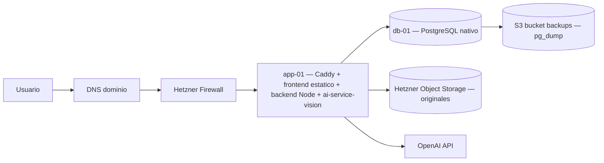

# Difactura: plan de produccion en Hetzner (v2 — replanteado desde cero)

## 1. Resumen de la auditoria (lo que ya esta bien y lo que no)

### 1.1 Lo que ya esta bien
- Pipeline de imagen (`ai-service-vision`): PDF -> PNG 300 DPI en RAM con PyMuPDF; fotos con auto-rotacion EXIF, upscale ×2 si ancho < 1200 px, downscale a 2048 px (OpenAI Vision con `detail=high` ya reescala a ~1024 px), nitidez ×1.35 y contraste ×1.15. **Esto ya entrega a OpenAI la mejor calidad util posible. No hay que tocar nada.**
- Cola en PostgreSQL con `FOR UPDATE SKIP LOCKED`: lista para escalar a varios workers cuando haga falta.
- Multi-tenant por asesoria/cliente, roles, auditoria, JSON extraido en `facturas.documento_json`.
- Recuperacion de jobs caidos (`PROCESSING_JOB_RECOVERY_INTERVAL_MS`).

### 1.2 Lo que esta mal

- `nginx/Dockerfile` y `nginx/nginx.conf` vacios -> los elimino, no hace falta nginx.
- `storage/processed/` creado en `server.js` y nunca escrito -> codigo muerto, fuera.
- `documentos.ruta_storage` guarda ruta absoluta del host -> resolver siempre por `STORAGE_BACKEND + storage_key`.
- CORS abierto en backend y en `ai-service-vision`.
- Sin rate limiting en login ni upload.
- Sin TLS configurado.
- `FAKEai-service-v2/` no entra en produccion.

### 1.3 La pregunta clave que planteaste sobre las imagenes

> "a la IA se la tengo que pasar con la mejor calidad posible pero a la hora de guardarlas no se que hacer exactamente"

**Respuesta corta y firme:**

- A la IA ya se le pasa la mejor calidad util (300 DPI desde PDF, original con EXIF corregido y enhancements suaves desde foto). Esto vive en RAM, **no se guarda**.
- Lo unico que hay que guardar es el **archivo original tal cual lo subio el usuario** (PDF, JPG, PNG, TIFF, WEBP). Sirve para:
  - Cumplir conservacion legal: 4 anos LGT art. 29 / 6 anos Codigo de Comercio art. 30.
  - Re-visualizar el documento durante la revision manual.
  - Reprocesar si se cambia el modelo de IA o el prompt.
- **No se guardan imagenes intermedias.** Son trivialmente reconstruibles desde el original, ocupan mas, y no aportan valor legal ni funcional. Si en el futuro hace falta miniatura, eso es un cache local con TTL, no almacen permanente.

Con esto la decision de almacenamiento se reduce a: "donde pongo los originales". Y la respuesta es **Hetzner Object Storage (S3) desde el dia 1** (justificacion en seccion 4).

---

## 2. Arquitectura propuesta

### 2.1 Topologia



### 2.2 Nodos

| Nodo | Tamano | Exposicion | Que corre | Como corre |
|---|---|---|---|---|
| `app-01` | CX32 (4 vCPU / 8 GB / 80 GB) | Publico (80/443) | Caddy + frontend (build estatico) + backend Node 20 + ai-service-vision (Python 3.11) | systemd nativo |
| `db-01` | CX22 (2 vCPU / 4 GB) + Volume 40 GB | Privado | PostgreSQL 15 | systemd / paquete `postgresql-15` de Debian/Ubuntu |
| Hetzner Object Storage | bucket `difactura-prod-uploads` | API S3 privada | Originales subidos | Servicio gestionado |
| Hetzner Object Storage | bucket `difactura-prod-backups` | API S3 privada | `pg_dump` cifrados | Servicio gestionado |

Coste aproximado al go-live: ~25-35 EUR/mes (2 VPS + volume + ~20 GB de object storage + ancho de banda).

### 2.3 Por que sin Docker en `app-01`

Originalmente Docker entro en el repo "porque si". Auditando lo que tienes:

- Son 3 procesos (Caddy, Node, Python) en un solo nodo.
- No hay multi-tenant a nivel de proceso.
- No hay despliegue blue/green.
- No hay otra plantilla de servidor.

Para ese tamano, Docker anade complejidad (Dockerfiles multi-stage, builds, registry, networks, volumes, healthchecks YAML) que **no se rentabiliza**. systemd te da:

- arranque/reinicio automatico,
- logs por journald (`journalctl -u difactura-backend -f`),
- limites de recursos (`MemoryMax=`, `CPUQuota=`),
- aislamiento basico (`ProtectSystem=strict`, `PrivateTmp=true`, `NoNewPrivileges=true`),
- sin daemon extra.

Si en el futuro Difactura crece a varios nodos de app o varios entornos, migrar a Docker (o Kubernetes ligero como k3s) es trivial: el codigo no cambia, solo el empaquetado.

> **Alternativa Docker**: si por preferencia personal quieres mantener Docker en `app-01`, ver Anexo A. La eleccion de Caddy y de Object Storage no cambia.

### 2.4 Por que Caddy y no nginx

- Caddy obtiene y renueva certificados Let's Encrypt **automaticamente**. Sin certbot, sin cron, sin renovaciones rotas.
- Configuracion en ~10 lineas (Caddyfile) en vez de un `nginx.conf` con `server { ... }`, `ssl_certificate`, `ssl_certificate_key`, `proxy_pass`, headers, etc.
- HTTP/2 y HTTP/3 por defecto.
- Hoy mismo te resuelve los dos ficheros vacios (`nginx/Dockerfile`, `nginx/nginx.conf`) sin escribirlos.

`nginx` sigue siendo perfectamente valido si lo prefieres por familiaridad o porque tu equipo lo conoce. Pero para 1 dominio + 1 backend HTTP + assets estaticos, Caddy es objetivamente menos trabajo.

### 2.5 Por que Object Storage (S3) desde el dia 1

| Criterio | Volume Hetzner + backup a Storage Box | Hetzner Object Storage (S3) desde el dia 1 |
|---|---|---|
| Durabilidad | La del disco; necesitas backup explicito | 11 nueves declarados, replicado por el proveedor |
| Backup de originales | Cron de `restic` o `rsync`, hay que monitorizar y restaurar a mano | Implicito (versioning + lifecycle rules) |
| Multi-nodo | No: el volume va atado a un VPS | Si por defecto |
| Disaster recovery del nodo | Reattach del volume, restaurar permisos, parar/arrancar servicios | El nodo nuevo ya ve los mismos objetos |
| Crecimiento >200 GB | Hay que migrar a S3 (la "Fase 2" del plan anterior) | Ya estas ahi |
| Coste 50 GB | ~5 EUR (volume) + ~3 EUR (Storage Box) | ~3-5 EUR/mes (Hetzner Object Storage) |
| Cambios de codigo | Pequeno (resolver por `STORAGE_PATH + storage_key`) | Pequeno (cliente S3 + URLs firmadas para descargar) |
| Operacion | Tu mantienes el backup y la restauracion | El proveedor mantiene la durabilidad |

El "ahorro" del Volume desaparece en cuanto sumas Storage Box y el tiempo de mantener los scripts. Y te ata a un nodo. **Saltar a S3 desde el dia 1 elimina la fase de migracion futura.**

Las facturas tienen un patron de acceso ideal para object storage: write-once, read varias veces los primeros dias, casi nunca despues de validadas, retencion 6 anos. Lifecycle rules de S3 las pueden mover automaticamente a clase fria a partir del ano 2.

---

## 3. Como queda el flujo en produccion

1. Usuario entra a `https://app.tudominio.com` (Caddy en `app-01`).
2. Caddy sirve el frontend estatico (`/var/www/difactura/`) y proxya `/api/*` al backend en `localhost:3000`.
3. Backend autentica y, en `POST /api/invoices/upload`, en lugar de `multer.diskStorage` usa el adaptador S3:
   - genera `storage_key = uuid().ext`,
   - sube el binario a `s3://difactura-prod-uploads/{empresa_id}/{storage_key}` (server-side encryption activado),
   - guarda en BD `documentos.storage_key` y opcionalmente el bucket. La columna `ruta_storage` queda como legado y se deja de escribir.
4. Backend crea factura + documento + job (igual que hoy).
5. Worker reclama el job, descarga el original de S3 a un `tempfile` local (o stream en memoria), llama a `ai-service-vision` por HTTP en `localhost:8001`.
6. `ai-service-vision` convierte a imagenes en RAM y llama a OpenAI (sin cambios).
7. Backend escribe el JSON en `facturas.documento_json` (sin cambios).
8. Cuando el usuario quiere ver el original, el backend devuelve una **URL firmada de S3 con TTL corto** (5 min). El navegador descarga directo del bucket.

Ningun fichero vive en disco local de forma persistente. `app-01` se vuelve **stateless**, lo que abarata enormemente la operacion (snapshots, recreacion, escalado).

---

## 4. Estrategia de almacenamiento (definitiva)

### 4.1 Que se guarda y donde

| Artefacto | Donde | Por que |
|---|---|---|
| Original subido por el usuario (PDF/JPG/PNG/TIFF/WEBP) | Hetzner Object Storage, bucket `difactura-prod-uploads`, key `{empresa_id}/{uuid}.ext`, SSE activado | Conservacion legal 6 anos + reprocesar |
| Imagenes intermedias 300 DPI PNG | RAM en `ai-service-vision` durante la llamada | No aportan valor legal y son reconstruibles |
| JSON extraido | PostgreSQL `facturas.documento_json` | Ya esta asi, funciona |
| `pg_dump` cifrados | Hetzner Object Storage, bucket `difactura-prod-backups` | Disaster recovery |
| Logs de aplicacion | journald de cada nodo + opcional envio a un Loki/Grafana hospedado | Observabilidad |

### 4.2 Lifecycle rules en S3

- `difactura-prod-uploads`: mover a clase fria (`HOT -> COOL`) a los 730 dias. Nunca borrar (politica de retencion).
- `difactura-prod-backups`: 30 backups diarios, despues 12 mensuales, despues 6 anuales. Borrar el resto.

### 4.3 Cuotas y limites

- `MAX_FILE_SIZE` en backend: 10 MB por archivo (suficiente para facturas, evita abuso).
- Alerta en el bucket cuando supere el 70% del presupuesto mensual previsto.

### 4.4 Cambios de codigo necesarios (minimos)

1. Crear `backend/src/services/storage/` con dos adaptadores: `LocalStorage` (para dev) y `S3Storage` (para prod), elegidos por `STORAGE_BACKEND=local|s3` en `.env`.
2. Reemplazar `multer.diskStorage` por `multer.memoryStorage` + `storage.put(key, buffer)` en el controller de upload.
3. Reemplazar `res.sendFile(document.ruta_storage)` por `res.redirect(storage.signedUrl(storage_key, 300))`.
4. Borrar `storage/processed/` del repo y la creacion del directorio en `server.js`.
5. Adaptar `ai-service-vision`: en vez de recibir el binario por multipart desde el backend, puede recibir directamente la URL firmada y descargarla. Opcional, simplifica el backend.

Estos cambios son ~150-200 lineas y dejan el sistema multi-nodo desde el dia 1.

---

## 5. Configuracion de los nodos

### 5.1 `db-01` — PostgreSQL nativo

```bash
# Ubuntu 24.04 LTS
apt install postgresql-15 postgresql-contrib
# Volume Hetzner formateado ext4, montado en /var/lib/postgresql/15/main (con noatime)
systemctl enable --now postgresql
# pg_hba.conf: solo IP privada de app-01 puede conectarse, metodo scram-sha-256
# postgresql.conf: listen_addresses = '<ip-privada-db>', max_connections=100, shared_buffers=2GB
```

Backups:

```bash
# /etc/cron.daily/difactura-pg-backup
pg_dump -Fc difactura | gpg --encrypt --recipient backup-key | \
  s3cmd put - s3://difactura-prod-backups/$(date +%Y/%m/%d)/difactura.dump.gpg
```

### 5.2 `app-01` — Caddy + Node + Python con systemd

Caddyfile (`/etc/caddy/Caddyfile`):

```caddyfile
app.tudominio.com {
    encode zstd gzip
    root * /var/www/difactura
    file_server
    handle_path /api/* {
        reverse_proxy localhost:3000
    }
}
```

Servicios systemd (resumen, `/etc/systemd/system/`):

```ini
# difactura-backend.service
[Service]
User=difactura
WorkingDirectory=/opt/difactura/backend
EnvironmentFile=/etc/difactura/backend.env
ExecStart=/usr/bin/node src/server.js
Restart=on-failure
NoNewPrivileges=true
ProtectSystem=strict
PrivateTmp=true
MemoryMax=1G
```

```ini
# difactura-ai-vision.service
[Service]
User=difactura
WorkingDirectory=/opt/difactura/ai-service-vision
EnvironmentFile=/etc/difactura/ai-vision.env
ExecStart=/opt/difactura/ai-service-vision/.venv/bin/uvicorn app.main:app --host 127.0.0.1 --port 8001
Restart=on-failure
NoNewPrivileges=true
ProtectSystem=strict
PrivateTmp=true
MemoryMax=2G
```

Despliegue:

```bash
# en el dev box
npm --prefix backend ci --omit=dev
npm --prefix frontend ci && npm --prefix frontend run build
# en app-01
rsync backend/ -> /opt/difactura/backend/
rsync frontend/dist/ -> /var/www/difactura/
rsync ai-service-vision/ -> /opt/difactura/ai-service-vision/
systemctl restart difactura-backend difactura-ai-vision caddy
```

Un script `scripts/deploy.sh` lo automatiza.

---

## 6. Variables de entorno

### 6.1 `app-01:/etc/difactura/backend.env`

```env
NODE_ENV=production
PORT=3000

JWT_SECRET=CAMBIAR
JWT_EXPIRES_IN=8h
BCRYPT_SALT_ROUNDS=12

DATABASE_URL=postgresql://difactura_user:CAMBIAR@<ip-privada-db>:5432/difactura

AI_SERVICE_URL=http://127.0.0.1:8001
AI_SERVICE_TIMEOUT_MS=300000

STORAGE_BACKEND=s3
S3_ENDPOINT=https://fsn1.your-objectstorage.com
S3_REGION=fsn1
S3_BUCKET=difactura-prod-uploads
S3_ACCESS_KEY=CAMBIAR
S3_SECRET_KEY=CAMBIAR
S3_PRESIGNED_TTL=300
MAX_FILE_SIZE=10485760

PROCESSING_POLL_INTERVAL_MS=3000
PROCESSING_JOB_STALE_MS=900000
PROCESSING_JOB_RECOVERY_INTERVAL_MS=30000
PROCESSING_JOB_MAX_RECOVERIES=2

FRONTEND_ORIGIN=https://app.tudominio.com
```

### 6.2 `app-01:/etc/difactura/ai-vision.env`

```env
OPENAI_API_KEY=CAMBIAR
OPENAI_BASE_URL=https://api.openai.com/v1
OPENAI_MODEL=gpt-4.1-mini
OPENAI_TIMEOUT_SECONDS=120
MAX_FILE_SIZE_MB=50
MAX_PAGES=8
IMAGE_DPI=300
```

Permisos: `chmod 640 /etc/difactura/*.env`, `chown root:difactura /etc/difactura/*.env`.

---

## 7. Seguridad

1. SSH solo por clave, root sin password, fail2ban activo en `app-01` y `db-01`.
2. Hetzner Cloud Firewall: `app-01` expone 22 (solo IPs admin), 80, 443; `db-01` expone 22 (admin) y 5432 solo a la IP privada de `app-01`.
3. CORS del backend cerrado a `https://app.tudominio.com`.
4. CORS de `ai-service-vision` deshabilitado (escucha en 127.0.0.1, no necesita CORS).
5. Rate limiting en backend con `express-rate-limit`:
   - login: 5 intentos / 15 min por IP,
   - upload: 30 archivos / hora por usuario.
6. Headers de seguridad via Caddy (`Strict-Transport-Security`, `X-Content-Type-Options`, `Referrer-Policy`, `Content-Security-Policy` minima).
7. Secretos: `.env` con permisos 640, owner `root:difactura`. Considerar `systemd-creds` o sops si crece el equipo.
8. JWT en `localStorage` se mantiene por simplicidad, pero si el frontend se reescribe, migrar a cookie `HttpOnly; Secure; SameSite=Lax` con CSRF token.

---

## 8. Salud y observabilidad

- `/api/health` ampliado: comprobar BD + AI service + escritura/listado en bucket S3.
- Logs por journald, exportables a Loki/Grafana cloud o un syslog gestionado si se quiere historial largo.
- Metricas minimas: jobs en `ERROR_PROCESAMIENTO`, latencia P95 del upload, latencia P95 de la llamada a OpenAI, % uso CPU/RAM por servicio. Cualquier UptimeRobot / BetterStack basico vale para alertar caidas y certificados.

---

## 9. Plan de despliegue por fases

### Fase 0 — Endurecer el repo (antes de tocar Hetzner)

- [ ] Borrar `nginx/`.
- [ ] Borrar `storage/processed/` del repo y de `backend/src/server.js`.
- [ ] Implementar `backend/src/services/storage/` con `LocalStorage` y `S3Storage`.
- [ ] Cambiar upload a `multer.memoryStorage` + `storage.put`.
- [ ] Cambiar `getDocumentFile` a `res.redirect(signedUrl(...))`.
- [ ] Anadir rate limiting y cerrar CORS.
- [ ] Generar `frontend/dist` con `npm run build` (sin Vite dev en prod).
- [ ] Probar todo en local con `STORAGE_BACKEND=local`.
- [ ] Probar en local con un MinIO contra `STORAGE_BACKEND=s3`.

### Fase 1 — Primera produccion en Hetzner

- [ ] Crear red privada Hetzner.
- [ ] Provisionar `db-01` (CX22 + volume 40 GB) e instalar PostgreSQL 15.
- [ ] Provisionar `app-01` (CX32) con Ubuntu 24.04, Node 20, Python 3.11, Caddy.
- [ ] Crear los dos buckets en Hetzner Object Storage y generar access keys con permisos minimos.
- [ ] Configurar firewall cloud.
- [ ] Desplegar codigo via rsync + systemd.
- [ ] Apuntar DNS a `app-01`. Caddy emite el certificado automaticamente.
- [ ] Programar `pg_dump` cifrado a S3.
- [ ] Validacion (seccion 10).

### Fase 2 — Cuando aparezcan disparadores

Disparadores reales (no por adelantado):

- >50 facturas/min sostenidas o jobs visiblemente en cola.
- Necesidad de zero-downtime deploys.
- Mas de un nodo de app.

Acciones:

- Separar el worker del backend web (mismo binario, comando distinto: `node src/worker.js`). El SQL ya esta listo (`FOR UPDATE SKIP LOCKED`).
- Anadir un segundo `app-02` y un balanceador (Hetzner LB).
- Empaquetar en imagenes Docker si se va a multi-nodo (es cuando Docker empieza a rentar).

---

## 10. Validacion de salida (checklist)

- [ ] `https://app.tudominio.com` carga, certificado valido, HTTP/2.
- [ ] Login funciona; rate limit corta a los 5 intentos.
- [ ] `GET /api/health` responde y comprueba BD + AI service + S3.
- [ ] Subir un PDF: el objeto aparece en `s3://difactura-prod-uploads/{empresa_id}/...`.
- [ ] Subir una foto JPG hecha con movil: se procesa con auto-rotacion (verificar con una factura girada).
- [ ] Job pasa por `SUBIDA -> EN_PROCESO -> PROCESADA_IA`.
- [ ] Visualizar el documento: el navegador recibe URL firmada de S3 valida durante 5 min.
- [ ] Reiniciar `app-01`: tras `systemctl restart`, todo accesible y los originales siguen disponibles.
- [ ] `pg_dump` del dia aparece en `s3://difactura-prod-backups/...` cifrado.
- [ ] Restaurar el `pg_dump` en una BD de pruebas y comprobar que abre.
- [ ] Reprocesar una factura ya validada: descarga del original desde S3 y vuelve a llamar a OpenAI sin error.

---

## 11. Que NO se hace y por que

- **No se guardan imagenes derivadas (PNG 300 DPI) en disco.** Son reconstruibles desde el original con coste despreciable; guardarlas multiplica espacio y backups.
- **No se mete el binario en PostgreSQL como `bytea`.** Infla la BD, ralentiza dumps, complica replicacion.
- **No se monta Storage Box por SSHFS/SMB para servir originales en caliente.** Es fragil y lento; vale solo como destino de backup secundario si se quisiera redundancia geografica.
- **No se usan multiples nodos de app desde el dia 1.** Sin trafico que lo justifique, complica el despliegue. La arquitectura ya es multi-nodo-ready (estado en S3 + BD), pasar a 2 nodos cuando haga falta es trivial.
- **No se despliega `FAKEai-service-v2`.**

---

## 12. Mi recomendacion final

Para sacar Difactura a produccion ya, sin sobrecoste y operable por una sola persona:

1. **Hetzner si**, dos nodos (`app-01` + `db-01`) en red privada.
2. **Sin Docker en `app-01`**: systemd + Caddy + Node + Python en bare metal.
3. **Sin nginx**: Caddy con TLS automatico.
4. **Hetzner Object Storage (S3) desde el dia 1** para los originales; bucket separado para backups de Postgres. Volume y Storage Box quedan fuera del plan.
5. **A la IA, calidad maxima util ya implementada (300 DPI, EXIF, enhancements). Nada que tocar**. Lo que se guarda es solo el original; las imagenes intermedias siguen viviendo en RAM.
6. **Refactor minimo en backend**: adaptador `S3Storage`, upload por buffer, descarga por URL firmada, eliminar `storage/processed/` y `ruta_storage` absoluta.
7. **Backups**: `pg_dump` cifrado nocturno a S3. Object storage no necesita backup explicito.
8. **Endurecer**: CORS cerrado, rate limiting, firewall cloud, headers de seguridad.

Este plan elimina todos los bloqueantes del plan anterior (`nginx/Dockerfile` vacio, `nginx.conf` vacio, certbot, gestion de volumes, scripts de rsync/restic, dos compose files separados, migracion futura a S3) **sin perder ninguna capacidad real**.

---

## Anexo A — Si prefieres mantener Docker en `app-01`

Si por preferencia personal o porque tu equipo lo conoce mejor quieres seguir con Docker en el nodo de aplicacion, el plan se mantiene **sustituyendo solo systemd por un `docker-compose.app.yml` con Caddy + frontend + backend + ai-service-vision**. El resto (Object Storage, sin nginx, sin Volume, backups a S3, refactor del adaptador de storage) se aplica igual.

Caddy se sigue prefiriendo a nginx por las mismas razones (TLS automatico, configuracion minima).

`db-01` puede quedarse en Postgres nativo (recomendado) o en un contenedor con volume dedicado; cualquiera de las dos vale.

## Anexo B — Si en el futuro quieres servicios gestionados

Cuando el coste de operacion supere lo que cuesta delegarla, los pasos naturales son:

- BD: pasar a Neon, Supabase, o PostgreSQL gestionado (DigitalOcean / OVH / Scaleway).
- Object Storage: ya estas en S3, portar a R2/B2/AWS S3 cambiando endpoint y keys.
- Despliegue: Fly.io, Render o Railway si quieres olvidarte del VPS.

Nada de la decision actual te ata: el codigo habla S3 estandar y SQL estandar.
